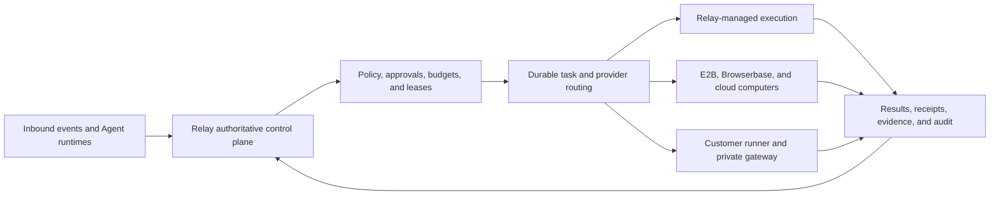

# Relay

Relay is a governed control plane for personal AI agents that act in the real world.

It gives Agents durable identity, bounded authority, human approvals, budgets, event-driven execution, and provider-neutral computers and connectors—without handing runtimes durable credentials or allowing execution providers to become independent control planes.

> **Release status:** Relay V2 implementation is complete in the current release candidate, but it is not approved for limited beta or GA. Local automation and the Relay-managed execution profile are qualified. Third-party providers, production topology, independent security review, human studies, and Product Owner release decisions remain mandatory WO-22 gates. See the [release dossier](docs/v2/qualification/wo22-release-dossier.md) and [gate matrix](docs/v2/qualification/wo22-gate-matrix.md).

Relay V1 remains frozen in RC soak. V2 is additive and guarded by an automated frontier check that prevents changes to the frozen V1 references.

## What Relay does

Relay separates durable authority from untrusted execution.

- The hosted control plane owns accounts, Agent identities and Passports, capabilities, policy decisions, approvals, budgets, leases, event routing, durable state, connector authorization, vault references, evidence, and audit.
- Execution happens through short-lived, task-scoped authority on Relay-managed infrastructure, third-party providers, or customer-hosted runners.
- Providers and runners receive only the minimum workload identity, capability lease, resource scope, call limit, and expiry required for one task.
- Consequential actions fail closed when policy facts, approval evidence, budget state, credentials, or provider outcomes are stale or ambiguous.
- Every trusted action is attributable to its account, Agent, runtime, task, policy decision, approval, budget, lease, provider placement, result, and evidence chain.

## Architecture



The control plane is authoritative. A customer-hosted runner is not a second control plane: it registers with Relay, polls outbound for bounded assignments, proves workload identity, enforces leases locally, and reports signed evidence and results back to Relay.

For the detailed contracts, start with the [security architecture](docs/v2/security/security-architecture.md), [execution provider SDK](docs/v2/execution-provider-sdk.md), and [events and tasks](docs/v2/events-and-tasks.md).

## V2 capability surface

| Area | V2 contract |
| --- | --- |
| Identity | Account membership, service clients, runtime attribution, Agent identities, and signed versioned Agent Passports |
| Authorization | Capability registry, contextual policy outcomes, capability leases, call/resource limits, expiry, and revocation |
| Human control | Central approvals, exact-action evidence, pause/takeover/resume, and protected credential entry |
| Money | Financial records, opaque payment references, purchase intents, hard budgets, approval-controlled checkout, and receipts |
| Execution | Provider-neutral scheduling across Relay-managed, Browserbase, E2B, and customer-runner contracts |
| Computers | Ephemeral browser, shell, and file sessions; screenshots; observation; fencing; cleanup; and evidence |
| Communications | Slack and Telegram inbound events and account-owned outbound replies with approval and reconciliation controls |
| Connectors | Constrained Google Drive and Linear capabilities with least-scope OAuth and permission-drift detection |
| Delegation | Same-account parent/child task handoff with bounded context, authority, budgets, revocation, and provenance |
| Developer platform | Versioned REST, stateless MCP, OpenAPI, JSON schemas, and TypeScript/Python reference clients |
| Operations | Multi-instance-safe PostgreSQL coordination, durable outbox, retries, dead letters, fencing, kill switches, and release gates |

The V2 surface is intentionally constrained. It does not claim unattended production payments, arbitrary connector APIs, persistent high-assurance desktops, an independently operated runner control plane, or a fully self-hosted Relay control plane.

## Security invariants

Relay is designed around several non-negotiable boundaries:

1. Every tenant-owned read, write, queue item, workflow, artifact, session, connector, approval, and budget is account-scoped and negatively tested.
2. Policy, approval, budget, and lease checks happen before consequential effects and are revalidated at execution boundaries.
3. Durable credentials remain behind control-plane vault references. Agent runtimes and providers receive bounded, short-lived authority instead.
4. Financial and destructive actions require exact, once-only human approval. New-recipient communication also has a mandatory approval floor.
5. A possibly committed external effect is never blindly retried. It enters reconciliation-required or dead-letter state.
6. Agent input and human takeover are mutually exclusive through monotonic fencing.
7. Provider claims are compatibility metadata, not security attestation. Live qualification is recorded separately for each provider and version.
8. Audit and evidence are redacted, signed, tenant-bound, and independently verifiable.

See [capability leases](docs/v2/capability-leases.md), [policy](docs/v2/policy-engine.md), [approvals](docs/v2/approvals.md), [budgets](docs/v2/budgets.md), and [evidence](docs/v2/evidence.md).

## Current qualification

The latest pre-merge campaign passed:

- V1/V2 frontier guard and Drizzle schema validation
- TypeScript typecheck and ESLint
- 172/172 runnable non-live tests
- 2/2 performance tests
- Production Next.js build
- 6/6 Relay-managed live Playwright/Docker provider tests
- 3/3 dashboard Playwright end-to-end tests

These results do not convert missing external evidence into a pass. Browserbase, E2B, customer-hosted runner, Slack, Telegram, Google Drive, Linear, production Temporal/database/object-store/KMS topology, build provenance, penetration testing, accessibility/comprehension studies, and deployment protections retain the statuses recorded in the [WO-22 gate matrix](docs/v2/qualification/wo22-gate-matrix.md).

## Requirements

- Node.js 22.5 or newer
- pnpm 9
- PostgreSQL 14 or newer
- Docker for local sandbox and Relay-managed execution qualification
- Playwright Chromium for browser and dashboard qualification
- Provider-specific applications and credentials only when running their opt-in live qualification packs

## Local development

```bash
git clone https://github.com/jaydubya818/relay.git
cd relay
cp .env.example .env.local
pnpm install
pnpm db:migrate
pnpm db:seed
pnpm dev
```

Open [http://localhost:3000](http://localhost:3000).

The local seed creates a dashboard owner and V1-compatible sample Agents. `pnpm db:seed` prints newly issued Agent credentials once; treat them as secrets. Change every example secret before exposing Relay outside a local development machine.

## Agent and runtime integration

V2 exposes durable runtime action submission at `POST /api/v2/runtime/actions` and a stateless MCP endpoint at `POST /api/v2/mcp`. Requests are bound to an account, runtime client, OAuth resource, workload identity, canonical action, capability lease, and idempotency key.

A successful submission means the command and wake-up are durable. It does not mean the external effect has completed.

See the [developer platform guide](docs/v2/developer-platform.md), [OpenAPI contract](docs/v2/openapi.yaml), [runtime compatibility matrix](docs/v2/runtime-compatibility.md), and reference SDKs in [`sdks/typescript`](sdks/typescript) and [`sdks/python`](sdks/python).

The V1 MCP endpoint and setup guide remain documented in [docs/mcp.md](docs/mcp.md) for the frozen RC surface.

## Testing

Provide a disposable PostgreSQL administrative database through `RELAY_TEST_DATABASE_URL`. Test helpers create and remove isolated `relay_test_*` databases.

```bash
RELAY_TEST_DATABASE_URL=postgresql://postgres@127.0.0.1:55432/postgres pnpm qualify
pnpm v2:frontier:check
pnpm db:check
pnpm test:e2e
```

Run the opt-in Relay-managed live provider qualification only on a machine where Docker and Playwright Chromium are available:

```bash
RELAY_LIVE_DOCKER=1 \
RELAY_LIVE_PLAYWRIGHT=1 \
RELAY_TEST_DATABASE_URL=postgresql://postgres@127.0.0.1:55432/postgres \
pnpm exec vitest run \
  tests/v2/relay-managed-provider-live.test.ts \
  tests/v2/relay-managed-provider.test.ts \
  --fileParallelism=false
```

Provider-specific live tests must use dedicated V2 test projects and credentials. Frozen V1 credentials and qualification evidence must not be reused as V2 evidence.

## Repository map

- [`app`](app) — Next.js dashboard and HTTP endpoints
- [`lib/v2`](lib/v2) — V2 control-plane domains and provider contracts
- [`drizzle`](drizzle) — additive PostgreSQL migrations
- [`sdks`](sdks) — TypeScript and Python reference clients
- [`tests/v2`](tests/v2) — V2 functional, security, isolation, and qualification coverage
- [`docs/v2`](docs/v2) — domain contracts and qualification evidence
- [V2 implementation ledger](docs/v2-implementation.md) — WorkOrder history and evidence
- [V2 release dossier](docs/v2/qualification/wo22-release-dossier.md) — release recommendation and blockers
- [V1 architecture](docs/architecture.md) and [V1 release candidate](docs/v1-release.md) — frozen V1 documentation

## Production readiness

Do not represent Relay V2 as limited-beta-ready or GA-ready until the fail-closed WO-22 gate passes and the Product Owner records the corresponding release decision. The production operating contract, rollout stages, rollback behavior, and incident ownership are defined in [release operations](docs/v2/operations/release-operations.md).

Implementation completeness and release authorization are deliberately separate.
