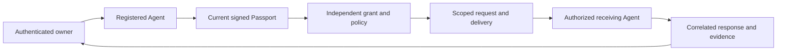

# Relay

Relay is the governed identity, capability and communication control plane for AI agents. It lets an owner register an Agent, establish its identity, authorize specific actions or peers, receive approvals and inspect correlated delivery/results without treating the agent runtime as the source of its own authority.

In the MyEve system, Relay connects independently owned agents and approved services. MyEve owns the conversation and private context; MyFactory owns admitted software production. Relay authentication or a delivered message grants neither access to private Memory nor permission to run Factory Work.

## Contents

- [Current status](#current-status)
- [How Relay fits with MyEve and MyFactory](#how-relay-fits-with-myeve-and-myfactory)
- [Identity and authentication](#identity-and-authentication)
- [Capabilities, grants and policy](#capabilities-grants-and-policy)
- [Messaging, federation and Knowledge](#messaging-federation-and-knowledge)
- [Wider V2 implementation surface](#wider-v2-implementation-surface)
- [Security and privacy invariants](#security-and-privacy-invariants)
- [Provisioning and retirement](#provisioning-and-retirement)
- [Local development](#local-development)
- [APIs and SDKs](#apis-and-sdks)
- [Tests and release checks](#tests-and-release-checks)
- [Operations, limitations and release decisions](#operations-limitations-and-release-decisions)
- [Repository map](#repository-map)

## Current status

**Documentation reconciled: October 6, 2026 (Pacific).** Canonical source baseline: [`8a8678d`](https://github.com/jaydubya818/relay/commit/8a8678d675adc8ac7f799d7660071de2256bb231). Source presence, local regression, a bounded live qualification and permission to release broadly are different claims.

| Surface | Current status | Boundary |
| --- | --- | --- |
| Existing operator authentication | Canonical email/password mechanism; same-identity recovery and session revocation qualified | GitHub/Google connection OAuth is not dashboard sign-in |
| Agent Passport enrollment | Merged canonical owner-authenticated issuance/readback/revocation and signature/binding validation | Passport enrollment does not create a capability grant or activate policy |
| Peer-message policy | Exact Agent/peer receiving policy with password step-up | Only explicitly selected directions; no standing unrestricted federation |
| Three synthetic owners | Bounded six-direction messaging, correlation, isolation and revocation qualification completed | Temporary authority is cleaned up; not a general live-provider certification |
| Two real external testers | Preparation underway; existing identity must be authenticated before linking | No invitation or access approval; no inherited operator/synthetic credentials |
| Broad Relay V2 release | Implementation and substantial automated/local-provider evidence exist | **Not a blanket limited-beta or GA readiness claim**; external/security/provider gates remain independently tracked |

Earlier preview and managed-beta documents retain their original dates and failures. The historical single-owner preview inventory and time-limited peer grants are not current account inventories or current grant assertions. An expired qualification grant must never be described as active merely because an older report says it was issued.

Public records summarize engineering outcomes. Account emails, private resource identities, credential material, live session data and raw private exchanges are intentionally omitted.

## How Relay fits with MyEve and MyFactory

| Component | Responsibility |
| --- | --- |
| **[MyEve](https://github.com/jaydubya818/MyEveBot)** | Sofie, persistent Agents, owner context, Work, decisions, Files/Memory and durable Result/Proof presentation |
| **Relay** | Registered identity, signed Passports, capability/grant/policy checks, governed messaging and integration contracts |
| **[MyFactory](https://github.com/jaydubya818/MyFactory)** | Exact Work admission, producer execution, budget/writer fencing, candidate custody, independent verifier and signed Results |


```mermaid
flowchart LR
  Owner[Authenticated owner] --> Agent[Registered Agent]
  Agent --> Passport[Current signed Passport]
  Passport --> Authority[Independent grant and policy]
  Authority --> Delivery[Scoped request and delivery]
  Delivery --> Peer[Authorized receiving Agent]
  Peer --> Result[Correlated response and evidence]
  Result --> Owner
```

Every arrow is a checked boundary. An Agent can be authenticated but lack a Passport; have a valid Passport but lack a grant; or hold a grant while policy still denies the action. A receiver's approval and scope are not implied by the sender's wishes.

## Identity and authentication

### Owner accounts and sessions

The dashboard uses Relay's canonical email/password authentication. Passwords are verified against the existing account record; session identity remains bound to that owner/account. Login, logout, expiry, retirement and session revocation have durable server-side meaning.

GitHub and Google OAuth configuration is for separately configured service connections. It must not be confused with the existing operator's dashboard password. Vercel deployment protection is another independent outer boundary and does not replace Relay application authentication.

Recovery must preserve the original account, owner membership, Agent IDs, grants, data and audit history. Do not create a duplicate account or substitute identity to work around a failed login. Use bounded exact-account recovery, revoke superseded sessions and verify same-identity readback. Never publish passwords, password hashes or session cookies.

### Agents and Passports

An Agent Passport is a signed, versioned identity and capability-eligibility statement. It binds the existing Agent, account, issuing owner principal, trust level, validity and signing-key identity. It is **not** a bearer credential, capability grant, policy allowance, provider credential or Work authorization.

Canonical messaging enrollment:

1. Authenticate the existing account owner and select an owned active registered Agent.
2. Declare only the required messaging eligibility and satisfy the receiving policy-definition requirement.
3. Issue through `POST /api/agents/{id}/passport` with exact expected version and expiry; messaging enrollment permits at most 24 hours.
4. Read back the current Passport and verify its signature and owner/Agent/account/key bindings.
5. Configure exact peer/resource grants and activate the independently reviewed policy.
6. On withdrawal, revoke the current Passport/grants and retire temporary policy while preserving signed history.

Issuance and replacement serialize through account/Agent locks and optimistic version checks. Revoked history remains immutable; a stale Passport cannot become current again. Public trust endpoints publish verification keys only. Private signing keys remain server-side. See [Agent Passport enrollment](docs/agent-passport-enrollment.md).

## Capabilities, grants and policy

Capabilities describe the supported operation. A grant narrows who may perform it, against which resource/peer, with what limits and expiry. Policy evaluates the actual request and can deny it, require approval or impose additional constraints. Capability leases bind admitted execution to a bounded task/runtime.

The receiving peer-message policy is deliberately narrow:

- `stage` creates an inactive account policy for one owned receiving Agent, the `messages` resource and one or two exact external owner/Agent peers.
- `activate` requires fresh password verification tied to that policy bundle hash.
- `retire` has its own fresh password challenge and preserves audit history.
- The policy permits only its exact `message.receive` scope; the sender still needs its exact peer/resource grant.
- A matching Relay safety denial, approval floor or limit cannot be removed by enrolling a Passport or activating a peer policy.

The API is `POST /api/v2/operator/message-policy`. Its name does not permit an operator to impersonate arbitrary owners. The service checks the owning account and canonical step-up evidence.

Revocation is rechecked at admission, delivery and result access. A credential cached by an agent must not outlive current durable authority. Lost or ambiguous delivery is reconciled against the same request instead of creating a duplicate effect.

## Messaging, federation and Knowledge

Relay supports registered peer discovery, signed requests, bounded delivery, durable receipts, response correlation, revocation and audit. Platform adapters allow compatible external agents to participate without making a particular model or vendor the identity authority.

- `message.send` and `message.receive` are distinct directions with explicit policy/grant requirements.
- Only the approved message and explicitly authorized context travel to the peer. Private chat, Memory, Knowledge, Files and credentials are not implicitly shared.
- An accepted request is pending work. A delivery acknowledgment proves receipt, not a written answer or completed task.
- A response must bind to the original request, conversation and peer before it is presented as that peer's answer.
- Governed Knowledge requires its own publication/view and retrieval grant. Messaging permission is insufficient.
- Optional automatic replies belong to the receiving application's policy and model budget; they do not authorize recursive conversations or private-context retrieval.
- Interoperability with an unconfigured platform or named bot is not established by a generic adapter or a synthetic test.

The synthetic three-owner qualification exercised all six intended directions, wrong-owner/Agent and revoked/expired authority denials, response correlation and cleanup. That limited result does not activate those directions permanently or grant real testers authority.

See [federation architecture](docs/federation/architecture.md), [platform contract](docs/federation/platform-contract.md) and [authority inspection](docs/federation/authority-inspection.md).

## Wider V2 implementation surface

The following contracts and implementations exist in source. Inclusion here is **not** a claim that every provider is installed, live-qualified or enabled in the initial MyEve external alpha.

| Domain | Implemented responsibilities | Qualification boundary |
| --- | --- | --- |
| Accounts and runtime clients | Membership, service identity, runtime attribution, owner/Agent binding | Every instance needs correct provisioning and isolation checks |
| Policy and approvals | Contextual decisions, exact-action approval, password step-up, audit | Human approval is not silently reusable for another action |
| Budgets and leases | Operation/resource limits, reservations, expiry and revocation | A configured budget is not a substitute for complete effect accounting |
| Events and tasks | Durable events, outbox, task routing, idempotency and cancellation | Durable acceptance does not prove an external effect |
| Computers | Ephemeral browser/shell/file contracts, observation, fencing and cleanup | Provider/version-specific live evidence required |
| Provider adapters | Relay-managed, Browserbase, E2B and customer-runner interfaces | Named adapters do not imply universal production certification |
| Communications | Slack/Telegram ingress and account-owned outbound reply contracts | Separate app installation, consent and live channel qualification |
| Connectors | Constrained Google Drive/Linear capability paths | Least-scope OAuth, drift checks and exact tenant qualification |
| Money | Financial records, opaque payment references, purchase intents, approvals and receipts | No unattended payment or custody-of-funds readiness claim |
| Delegation | Bounded same-account parent/child tasks, context and provenance | Delegation cannot mint broader authority |
| Developer access | Versioned REST, stateless MCP, schemas and reference SDKs | Callers still need runtime identity, resource scope and leases |
| Operations | PostgreSQL coordination, fences, kill switches, audit and release gates | Production topology/recovery/security review remains separately qualified |

A customer runner polls outbound for bounded assignments and returns evidence; it is not a second control plane. Provider capability metadata is not security attestation. Optional computer/session views do not extend an execution lease.

## Security and privacy invariants

1. Account-owned rows, queues, artifacts, sessions, grants, connectors, approvals and budgets are scoped and negatively tested.
2. Credentials, Passport identity, grant authorization, receiving policy and provider execution remain separate checks.
3. Durable provider secrets stay in their authorized server-side custody; workload authority is narrow and short lived.
4. Consequential effects revalidate authority, expiry, budget and fencing immediately at the execution boundary.
5. Ambiguous external effects enter reconciliation rather than blind retry. A transport timeout does not prove nothing happened.
6. Agent execution and human takeover cannot both hold the authoritative writer fence.
7. Revocation/retirement preserves attributable history while blocking new access.
8. Evidence must be correlated, scoped, redacted and verifiable; it does not grant publication or another owner's data.

See [security architecture](docs/v2/security/security-architecture.md), [policy](docs/v2/policy-engine.md), [leases](docs/v2/capability-leases.md), [approvals](docs/v2/approvals.md), [budgets](docs/v2/budgets.md) and [evidence](docs/v2/evidence.md).

## Provisioning and retirement

Public signup and invitation-controlled signup are distinct deployment choices. The initial external-alpha workflow is operator-controlled preparation followed by explicit cohort access approval. Preparing an account must not send an invitation or enable standing authority accidentally.

Reuse an existing identity only after its owner authenticates. Never link based solely on email or reuse another owner's sessions. New accounts, Agents and credentials must be unique. An invitation is an enrollment capability, not a Factory execution grant.

The beta identity lifecycle supports pending invitation revocation and conditional acceptance. Disposable beta accounts use canonical retirement, not ad hoc deletion: dependent sessions, credentials, grants, relationships and pending work are fenced, while audit/receipt references remain attributable. Already delivered information cannot be recalled. External resource dependencies may block retirement until reconciled. See [identity lifecycle](docs/beta-identity-lifecycle.md).

## Local development

Requirements: Node.js 22.5 or newer, pnpm 9, PostgreSQL, and Docker/Playwright only for relevant local provider/browser qualification.

```bash
git clone https://github.com/jaydubya818/relay.git
cd relay
cp .env.example .env.local
pnpm install --frozen-lockfile
# Configure a dedicated local database and unique local secrets.
node --env-file=.env.local --import tsx scripts/migrate.ts
node --env-file=.env.local --import tsx scripts/seed.ts
pnpm dev
```

Open `http://localhost:3000`. The demo seed is for local development only and can print newly issued Agent credentials once. Do not run it against hosted data or put its output in public artifacts. Hosted owner initialization uses the separately reviewed `scripts/bootstrap-owner.ts` path and rejects ambiguous state. Supply its environment explicitly, for example `node --env-file=.env.local --import tsx scripts/bootstrap-owner.ts` with the intended operator configuration. Do not run bootstrap against an unverified database binding.

The migration, seed and bootstrap scripts do not automatically load `.env.local`; the explicit Node environment flag above prevents them from silently targeting a different database from Next.js. The [environment example](.env.example) describes database, session/encryption, connector and feature configuration. A service connection's OAuth settings are not a dashboard authentication mechanism. Do not enable unrelated providers just to make a smoke test pass.

## APIs and SDKs

| Endpoint family | Purpose |
| --- | --- |
| `/api/auth/*` | Canonical dashboard authentication and sessions |
| `/api/agents/{id}/passport` | Owned Agent enrollment/status/revocation |
| `/api/v2/operator/message-policy` | Exact peer-message policy lifecycle with fresh step-up |
| `/api/v2/runtime/actions` | Durable bounded runtime action submission |
| `/api/v2/mcp` | Stateless V2 MCP interface |

Runtime actions bind account, client, workload identity, canonical action, capability lease, resource and idempotency key. A successful submission means acceptance and wake-up are durable; it does not mean the requested effect has completed.

Use the [developer platform guide](docs/v2/developer-platform.md), [OpenAPI](docs/v2/openapi.yaml), [runtime compatibility matrix](docs/v2/runtime-compatibility.md), [TypeScript SDK](sdks/typescript), [Python SDK](sdks/python) and [V1 MCP guide](docs/mcp.md). Frozen V1 references remain protected by the V2 frontier check.

## Tests and release checks

```bash
pnpm v2:frontier:check
pnpm db:check
pnpm typecheck
pnpm lint
# Set RELAY_TEST_DATABASE_URL to a disposable local administrative database.
pnpm test:ci
pnpm test:performance
pnpm build
```

`pnpm qualify` combines types, lint, non-live tests, performance tests and build. `pnpm test:e2e` covers the browser suites. Database helpers create isolated test databases; never point them at a production database. Live Docker, Playwright or provider campaigns are explicit opt-ins and may allocate resources.

The repository [CI workflow](.github/workflows/ci.yml) runs against disposable PostgreSQL and includes the frontier, schema, type, lint, regression, performance and build gates. A skipped live test is not a live pass. Historical test totals apply only to the commit/campaign that recorded them; consult the actual current CI run for current counts.

## Operations, limitations and release decisions

Keep runtime actions and optional integrations disabled until their specific profile is qualified. Revoke exact grants, retire temporary peer policies and verify the formerly authorized direction is denied. Credential/session cleanup must preserve canonical identities and history.

Rollouts require authenticated source/configuration readback, schema compatibility, protected secrets, recovery/backup evidence and an explicit feature allowlist. Do not infer deployment readiness from a local suite or an old preview report.

Broad V2 release still requires its applicable external provider, production topology, independent security, penetration-testing, human-control/accessibility and owner-decision gates. See the dated [WO-22 release dossier](docs/v2/qualification/wo22-release-dossier.md), [gate matrix](docs/v2/qualification/wo22-gate-matrix.md) and [release operations](docs/v2/operations/release-operations.md). Narrow MyEve messaging qualification does not close unrelated payment, desktop or connector gates.

The current two-tester mission includes qualified owner-facing Relay only. It does not enable unrestricted federation, Rooms, general runtime execution, payments, Factory grants or paid Work through Relay itself.

## Repository map

| Path | Responsibility |
| --- | --- |
| [`app`](app) | Dashboard and HTTP endpoints |
| [`lib/auth.ts`](lib/auth.ts) | Canonical owner authentication |
| [`lib/v2`](lib/v2) | Policy, Passports, leases, providers and V2 control plane |
| [`lib/v2/federation`](lib/v2/federation) | Peer identity, policy, transport and correlation |
| [`drizzle`](drizzle) | Canonical additive schema history |
| [`sdks`](sdks) | Reference clients |
| [`tests`](tests) | Authentication, isolation, protocol, provider and release tests |
| [`docs/v2`](docs/v2) | Domain contracts, operations and dated qualification |
| [`docs/federation`](docs/federation) | Federation contracts and historical campaigns |
