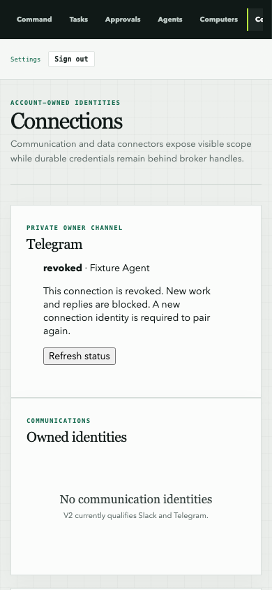

# Telegram integration with current main — 2026-09-24

Source integration is validated with execution disabled. Live Telegram is NOT_RUN.
This report supersedes the older branch's integration instructions; historical live
Eve 0.27.13 evidence does not qualify the current Eve 0.66.3 runtime.

## Source and migration boundary

- Relay main baseline: b867b90b9134a6f46aeea7398af5b4118edfec3a.
- Telegram source: feat/relay-v2-telegram-private-beta at 953883c.
- Integration merge: e7a33b3.
- Companion MyEve integration merge: b80c56f, based on main 67550453ce1c87dd20631ca6664ee78fad5f4e3e.
- Preserved canonical federation migration 0021 and its snapshot unchanged.
- Generated Telegram pairing 0022 and channel execution 0023 from the combined schema.
- Migration tests upgrade baselines 0020, 0021 and 0022, preserve a sentinel,
  and apply the final migration chain twice.
- Old disposable branch databases with the alternate Telegram 0021/0022 lineage
  are not an in-place upgrade target. Use a clean synthetic database or a separately
  reviewed migration plan; never replace a deployed migration ledger.

## Validation

| Check | Result |
| --- | --- |
| Relay regression | 397 passed; 6 skipped |
| Real Relay/MyEve modules with synthetic model/provider fixtures | 1 passed separately |
| Schema check, typecheck, lint, V2 frontier | Passed |
| Database performance | 2 passed |
| Production build | Passed |
| Mobile/keyboard Telegram management browser scenario | 1 passed; Telegram API mocked |
| MyEve companion | 1,024 unit tests, 135 Node tests, 39 database-backed Telegram tests passed |
| MyEve production build | Webpack passed; default Turbopack blocked by local port-binding permissions |
| Live Telegram / current live model journey | NOT_RUN |

Tests used a newly initialized disposable PostgreSQL instance on loopback port
56583 and a browser server on 3267. Existing owner services, data and ports were
untouched. No bot credentials, real Telegram sends, model calls, deployments,
cloud resources or KMS changes were used. Generated credentials in unit fixtures
are synthetic and remain local.

## Preserved authority

Both immutable Telegram release constants remain false. Federation defaults remain
disabled. Vercel automatic deployment is disabled for main and the integration branch.
Current MyEve expiry, current-session and exact approval-generation checks remain.
A Telegram approval cannot extend an expired canonical Run. Exact completed approval
retries return recorded completion without invoking an adapter. Session creation,
observation and cancellation use the current Eve client API. Cancellation accepts
its documented `no_active_turn` acknowledgement without fabricating a session ID.

## Remaining owner setup and release work

1. Identify a dedicated bot by public @username and a secure token-storage reference.
   Never put the token in chat, Git or this document; do not reuse another bot.
2. Select and authorize the existing hosted target, dedicated owner/Agent mapping,
   HTTPS webhook, signer/trust mapping, worker and budgeted model authentication.
3. Apply current migrations through the normal runners on the authorized target.
4. Execute the bounded live Telegram/model golden path and validate restart,
   cancellation, private-data isolation, approvals, budget and delivery ambiguity.
5. Change release gates only after that evidence is reviewed; deploy separately.

Merging source is not deployment or release qualification. Independent federation
security and production-platform gates remain NOT_RUN. Readiness remains
NO-GO — EXTERNAL QUALIFICATION PENDING.
