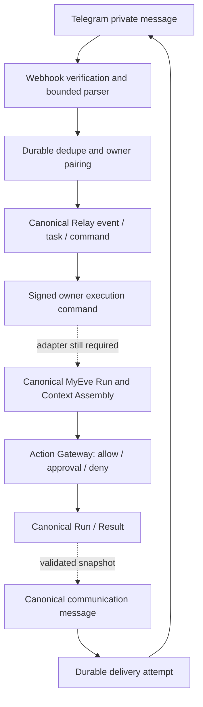
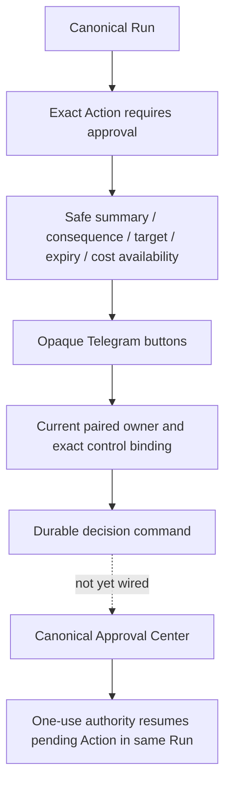
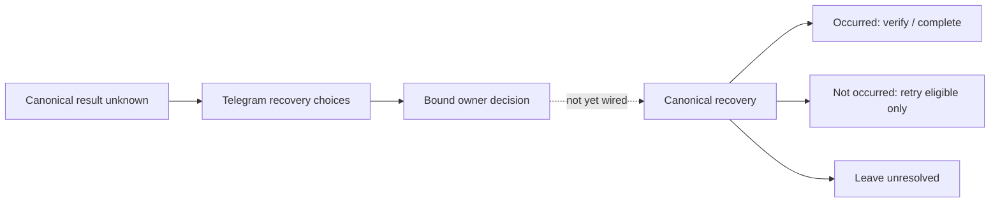
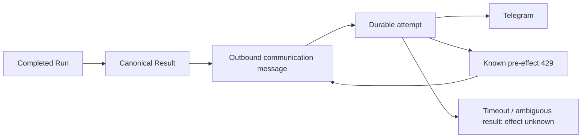

# Telegram private-beta qualification record

## Verdict and scope

**INCOMPLETE — NOT_READY_FOR_HOSTED_GOLDEN_PATH. NOT_READY_FOR_LIMITED_BETA.**

The published checkpoint implements the Relay channel pipeline. The unpublished continuation adds a canonical MyEve companion and passes a cross-repository component path. It does **not** qualify actual Eve model execution or live Telegram approval continuation. Missing credentials are not the blocker. The remaining work is code and qualification, listed below. `OWNER_EXECUTOR_QUALIFIED` is deliberately false: configuration cannot enable this unfinished execution path. The existing `private-preview` execution denial is also retained.

- Live Telegram scenarios: **0**.
- Hosted resources created, live webhooks registered, Production execution enabled, merges to main: **0**.
- Production-capable Ed25519 signing implementation: **PRESENT**.
- Production signing credential: **NOT CONFIGURED**; no credential requested in chat.
- Dedicated private-beta bot required: **YES**; not created.
- No local fixture is counted as live evidence or as canonical MyEve execution evidence.

The sections through “Final verification update” preserve the historical `6fc769d` checkpoint. Statements there about missing adapters describe that checkpoint; the continuation addendum below records subsequent implementation and current blockers.

## Source identity

- Relay canonical main inspected: `7ea29b2886d2b8bad7b1a1ca1c3e8df1d39ee9ee`.
- Continuation parent: `89d6b053196566486648c3bbc7ac36d196a0e0c1` on `feat/relay-v2-telegram-private-beta`.
- Earlier foundation: `dc296d5` path-safe Vitest alias; `7097f00` provider error containment; `cd2c298` enrollment/input; `89d6b05` historical evidence.
- MyEve inspected without source changes: `396631a`, branch `codex/openbot`. Its Federation, Action Gateway and routine tests are existing-component regressions, not Telegram integration tests. Concurrent unrelated edits appeared in that checkout during this task and were preserved; these runs are observations of the working tree, not attestations of a clean immutable MyEve commit.
- Relay migration sequence is independent of MyEve. Relay main ends at 0020, enrollment at 0021, this additive migration at **0022_channel_execution**. No prior migration is rewritten. MyEve migration numbers are not used to select Relay numbers.
- Work was performed in an isolated shared clone after reads in the original worktree stalled. The original worktree was preserved. Implementation commit: `842702ab5a9ba683925549cd50f1bda994756ec3`. Security-patch commit: `133e657`. Permanent handoff checkout: `/Users/jaywest/Documents/ChatGPT/New project/relay-telegram-channel-continuation`.

## Implemented architecture



`lib/v2/channels` contains strict transport contracts, signing/configuration, durable admission, control correlation, worker dispatch, outbound delivery and owner management. The Telegram parser and sender remain provider-specific. The WorkRequest and sender interfaces do not accept provider credentials or model-selected destinations.

Relay reuses `v2_events`, `v2_tasks`, `task_commands`, `communication_threads`, `communication_messages` and capability grants. The channel worker owns only `CHANNEL_*` commands; the existing Temporal worker claims/reaps only `START_TASK`. Admission writes the canonical event, task, command, encrypted message and channel link in one transaction. A failed admission does not acknowledge durable work.

Migration 0022 adds projections for channel-to-canonical-Run references, opaque control correlation, delivery attempts, signature nonces and command receipts. It does not add another Run, Action, Approval or Result authority model. The generated full-schema snapshot explains most of the diff size. Changing canonical orchestration is limited to transactional admission and command-kind isolation.

## Trust boundaries

| Boundary | Evidence / enforcement |
|---|---|
| Telegram provider authenticity | Constant-time verification of `X-Telegram-Bot-Api-Secret-Token` before parsing |
| Telegram user identity | Stable numeric private-chat and sender IDs; sender must equal chat; bot updates rejected |
| Relay owner identity | Five-minute, one-use owner-created pairing challenge; active human OWNER membership rechecked |
| Agent identity | Exact assigned account-owned Agent, current status and explicit channel grants; no fallback |
| Relay signing | Pinned Ed25519 key ID, environment, audience and exact command hash |
| MyEve owner / Agent mapping | **Not implemented**; must be explicit, independently authorized and rechecked by the canonical adapter |
| Action authority | **Not granted by pairing or signature**; canonical Action Gateway must decide |
| Channel destination | Stored binding and canonical thread; final send rechecks identity and permission |

Federation authority must not be accepted at the owner-ingress endpoint. The existing MyEve Federation work adapter uses different authority and context rules and was not repurposed. Owner-private Knowledge access through Telegram remains unqualified until the canonical adapter enforces Context Assembly scope.

## Pairing, admission and management

The owner management API is `/api/v2/operator/telegram`; the panel is on `/v2/connections`. Mutations require an authenticated owner session and same-origin request. Pairing explicitly grants receive/reply channel capabilities and creates a deep link; only the challenge hash persists. The link is returned only to the owner, is not logged, and expires after five minutes. Refresh after pairing observes durable state.

The private input boundary accepts at most 32 KiB raw JSON, 4096 text characters and two seconds to read the body. Group/channel/edited/forwarded/reply-context/media updates and bot-generated input are rejected. Attachments are not downloaded. Messages predating pairing are rejected. Duplicate update/message IDs return the original admitted task. User text cannot select another owner or Agent.

One canonical communication thread maps to the paired private chat. Admission allows at most ten messages per minute and four unfinished requests per binding. Work starts in chat order; only one command per binding is dispatched at a time. `/help`, `/start` without a challenge and `/status` produce bounded infrastructure replies without starting an Agent Run. Unknown commands produce a safe response.

The management panel covers not configured, ready to pair, paired, revoked, Agent unavailable, execution disabled, approval/recovery waiting, delivery failure and provider attention. Revocation requires an explicit UI confirmation. Pairing and send/dispatch boundaries share a database lock so a completed revocation prevents new dispatch/send. Re-pairing requires a new connection identity; stale controls remain bound to the revoked identity.

**Limit:** revocation does not yet cancel work already admitted inside MyEve. Executor-side lease/cancellation propagation remains required. This is another reason execution stays release-gated.

## Signing and execution contract

The Relay process owns the private Ed25519 key. The executor owns a pinned map of public keys and never receives the private key. The signed canonical envelope includes:

- Domain `relay.owner-execution.v1`, environment, audience, key ID and scope `owner.run`.
- UUID nonce, issued timestamp and expiry exactly 60 seconds later; at most five seconds future clock skew, at most 60 seconds age, and no expired request.
- SHA-256 canonical command hash covering command ID, operation, account, owner, Agent, thread, task/request, source binding, ingress, message, lifetime, budget and exact decision reference/hash/choice.

The receiver verifies before runtime authorization, consumes a durable nonce, and records a durable command receipt. Reusing the same envelope is rejected. A newly signed identical command can retrieve a completed receipt; changed bindings are denied. A receipt without a confirmed response requires canonical reconciliation, never blind re-execution. Cached responses are encrypted.

HTTP dispatch pins one HTTPS endpoint, refuses redirects and bounds response size. The worker fences its database claim, rechecks channel authority immediately before dispatch and records canonical Run/Result references from the snapshot. Ambiguous transport outcomes become status reconciliation. A crashed start is not resent automatically. Retry exhaustion becomes a visible dead-lettered Relay task. Pending work has a 24-hour channel lifetime and status polling is delayed, not a busy loop.

The request declares bounds of 60 execution seconds, eight model steps, 12,000 tokens, USD 0.10 model spend and twelve actions. **These are contract declarations, not yet proven canonical runtime enforcement.** A concrete adapter must enforce them before the release gate changes.

Rotation seam: install a new pinned public key in the executor, switch Relay's configured key ID/private key, then remove the old public key after the 60-second request window. Separate Preview and Production keys, audiences, environment identifiers and storage. Removing a trusted key denies it immediately.

## Approval and recovery



Callback data contains only a random control ID and a bounded choice. It contains no action parameters, credentials or approval token. Correlation is durable and bound to account, pairing, task, canonical reference, immutable binding hash, kind and expiry. Wrong owner, revoked pairing, wrong choice class, expired control or changed pending snapshot is denied. A database lock allows one decision to win; replay cannot enqueue another decision.

The implemented test proves callback correlation and one durable decision command. It does **not** prove a canonical approval decision or provider effect. Research=1, draft=1, effects before=0, effects after=1 remain **NOT QUALIFIED** for Telegram.



Recovery uses the same opaque-control projection and a distinct command operation. It must delegate to MyEve's existing recovery CAS; no channel-side recovery mutation or automatic resend is implemented. Telegram callback spinner acknowledgement and expired-button presentation still need qualification.

## Work completion and delivery



Delivery never restarts Agent work. At most three attempts are allowed, and only a confirmed Telegram 429 with `ok:false` schedules retry (delay clamped to 1–3600 seconds). Authentication failure marks the connection as needing attention. Invalid/blocked destinations fail permanently. Network errors, malformed responses and 5xx are ambiguous and are not automatically resent. A crashed SENDING attempt becomes EFFECT_UNKNOWN.

The provider receives plain text with previews disabled and no Markdown/HTML parse mode. Replies are bounded to 3800 characters. Longer results are shortened with a notice; a canonical full-result deep link is still missing. Destination identity is taken from stored binding/thread state and rechecked at the final send boundary. Revoked queued replies are suppressed.

Message text, result snapshots, reply bodies and command responses use the existing encrypted secret envelope at rest. Audit events and delivery receipts contain safe IDs, outcomes and attempt counts, not bodies or provider exceptions. Synthetic private-text tests verify absence from stored audit/message JSON outside ciphertext. Automatic content retention/Forget integration and nonce/receipt pruning remain unimplemented; no new retention promise is made.

## Configuration contract

All values belong in the isolated deployment's approved secret/configuration store, never a Codex message or committed `.env`.

| Variable | Secret? | Consumer / purpose |
|---|---|---|
| `RELAY_TELEGRAM_ENABLED` | No | HTTP ingress and channel worker, default false |
| `RELAY_TELEGRAM_EXECUTION_ENABLED` | No | Requested execution flag; release gate and private-preview denial still override |
| `RELAY_DEPLOYMENT_MODE` | No | Existing deployment isolation; `private-preview` always denies execution |
| `RELAY_CHANNEL_ENVIRONMENT` | No | Signing domain: development / preview / production |
| `RELAY_TELEGRAM_CONNECTION_ID` | No | Exact canonical bot connection |
| `RELAY_TELEGRAM_ACCOUNT_ID` | No | Exact Relay account |
| `RELAY_TELEGRAM_OWNER_PRINCIPAL_ID` | No | Explicit human owner, never first sender |
| `RELAY_TELEGRAM_AGENT_ID` | No | Explicit assigned Agent, never primary fallback |
| `RELAY_TELEGRAM_BOT_USERNAME` | No | Bot identity and pairing deep link |
| `RELAY_TELEGRAM_BOT_TOKEN` | **Yes** | Outbound Telegram sender only |
| `RELAY_TELEGRAM_WEBHOOK_SECRET` | **Yes** | Ingress authentication; 32–256 base64url characters |
| `RELAY_OWNER_EXECUTOR_URL` | No | Pinned HTTPS execution endpoint; **concrete MyEve route not implemented** |
| `RELAY_OWNER_EXECUTOR_AUDIENCE` | No | Exact expected executor audience |
| `RELAY_CHANNEL_SIGNING_KEY_ID` | No | Public key lookup identifier |
| `RELAY_CHANNEL_SIGNING_PRIVATE_KEY` | **Yes** | PKCS8 Ed25519 PEM; Relay signing only |
| `RELAY_DATABASE_URL` (or `DATABASE_URL`) | **Yes** | Canonical isolated PostgreSQL: pairing, dedupe, work, delivery, controls |
| `RELAY_ENCRYPTION_KEY` | **Yes** | Existing at-rest encryption boundary |
| Public worker origin | No | Host-level HTTPS origin for registration; no hard-coded deployment URL |

Executor configuration additionally needs explicit Relay-account/owner/Agent to MyEve-owner/Agent mapping, public-key pins, isolated replay storage and canonical runtime readiness. This is a missing implementation contract, not a request for credentials.

Webhook route: `https://<isolated-worker>/api/channels/telegram/webhook`. Readiness route: `/api/channels/telegram/ready`; ordinary health remains `/api/health`. Health means process serviceability. Channel readiness checks configuration and storage. Execution readiness additionally checks active pairing, owner/Agent/grants and the qualification gate; it is currently false. Neither liveness nor populated environment variables establishes canonical execution readiness.

Webhook secret setup, for the future authorized live phase: generate a high-entropy base64url secret in the approved secret-management environment; inject it in Relay; supply the same value as Telegram's `secret_token` at `setWebhook`; Relay verifies the header. Rotation requires updating registration and Relay together. Revocation requires disabling ingress/execution and removing the webhook. No production secret was generated here.

## Host requirements and unexecuted live plan

A compatible host must run a persistent HTTPS Node service (`pnpm start`) plus a supervised background process (`pnpm worker:channels`), connect to isolated PostgreSQL, inject secrets, permit outbound HTTPS to the pinned executor and Telegram, and provide restart/shutdown controls and logs without sensitive bodies. A conventional VM/container service or container PaaS satisfies these runtime requirements. A request-only serverless deployment needs a separate durable worker and does not by itself satisfy them. Compare costs only after sizing; no pricing or provider selection is claimed here. No proprietary queue is required.

After the missing code/qualification is complete:

1. Deploy an isolated worker and database; apply Relay migrations; configure a synthetic owner and test Agent. Keep execution disabled. Install public-key pins and explicit cross-runtime mappings. Verify health separately from readiness.
2. Owner creates a dedicated bot using BotFather `/newbot`, chooses a name/unique username, and stores its token in the approved secret store. Do not paste it into chat. Register only the isolated webhook with the secret header. The owner creates and consumes the one-use pairing link.
3. Use an explicitly qualified execution profile that preserves existing private-preview denial. Enable only the isolated test path after readiness is true. Ask “What are my active goals?” and correlate exactly one ingress, WorkRequest, canonical Run, Result and Telegram reply.
4. Request a harmless reversible artifact write in an isolated workspace through the canonical Action Gateway. Verify zero effects before approval and exactly one afterward, same Run, research/draft once, callback replay denied. Do not substitute real email, calls or publishing.
5. Exercise recovery without resend, duplicates, restart at admission/approval/delivery, disablement and revocation. Record IDs and sanitized evidence only.
6. Disable execution, revoke pairing, remove the webhook, remove disposable fixtures/resources and their secrets. Preserve the bot only if the owner elects to keep it for beta.

No step above was executed live.

## Qualification evidence and remaining gates

The PostgreSQL fixtures use disposable local PostgreSQL 17 at loopback port 55439. Migrations are exercised from a fresh database and from both prior Relay schemas 0020 and 0021; repeated migration preserves sentinel data.

The 18 new channel tests qualify durable ingress/dedupe, worker status reconciliation, callback correlation, permission/revocation checks, encryption containment, bounded queue, signature replay/mutation/environment rejection, provider classification and delivery-only retry. The executor in these tests is a deterministic **transport fixture**, not a canonical Agent runtime. Existing enrollment/parser tests continue to cover expiry, replay, malformed/private-only input and bot/attachment rejection.

Current local checks and final source identity are recorded in the verification update below. Do not add focused reruns to distinct-test totals.

Remaining implementation requirements before `READY_FOR_HOSTED_GOLDEN_PATH`:

- Concrete authenticated MyEve owner-ingress endpoint and governed canonical Run/Context Assembly adapter with explicit cross-runtime identity mapping.
- Generic canonical immutable pending-action checkpoint and continuation, independent of routine occurrences; true research/draft/effect counter proof through Action Gateway.
- Canonical recovery decision integration, owner/channel revocation propagation to already-admitted work, cancellation, and budget enforcement at each execution/effect boundary.
- Durable reconciliation for a crash after Relay dispatch claim but before canonical Run admission. Current behavior is safe refusal/reconciliation, not a proven liveness recovery.
- Full requested security matrix, private Knowledge/Federation separation for the new ingress, recovery and approval expiry/replay/restart effects, retention/Forget handling, callback acknowledgement and full-result navigation.
- Hosted golden path remains deliberately unrun. Human approval comprehension/accessibility review, independent security review and cohort authorization are separate later gates.


## Final verification update — 2026-09-20

| Check | Observed result |
|---|---|
| Relay serial regression suite, patched dependencies | 47 files passed, 3 opt-in files skipped; **231 passed / 5 skipped** |
| Final focused run after timeout/scoped-worker fixes, including opt-in providers | 5 files / **40 passed**; overlaps the serial suite, not additive |
| Distinct Relay non-performance tests across these runs | **237 passed**, including the new timeout test and all five opt-in tests |
| Existing performance tests | **2 passed**; dashboard p95 1.238458 ms; concurrency p95 37.347500 ms, 64 operations, zero error rate |
| Production-build mobile/keyboard test | **1 passed** at 390 × 844; management states, overflow and keyboard revocation; API state fixtures |
| MyEve existing regression subset | 10 files / **124 passed** (Federation, Action authority/recovery, routine admission/resume/release) |
| Existing MyEve executor inventory | 513 classified sources; **UNKNOWN=0**; routine activation remains disabled |
| Typecheck / lint / final production build | **PASS** |
| Fresh schema and upgrades from Relay 0020 and 0021 | **PASS**, including repeat migration and sentinel preservation |
| Drizzle consistency / frontier check / diff whitespace | **PASS** |
| Production dependency audit | **No known vulnerabilities found** after scoped patches |
| Patched sharp image processing | **PASS**, local synthetic PNG resize |
| Canonical Telegram Run / approval / recovery golden paths | **NOT QUALIFIED**; deterministic transport fixtures do not substitute |
| Live Telegram / hosted qualification | **NOT RUN**, explicitly zero scenarios |

Dependency qualification initially found nine advisories (two critical, five high, two moderate). The isolated fix updates Next and its ESLint package to 15.5.24, Playwright/test to 1.55.1, and pins Next's PostCSS to 8.5.23 and sharp to 0.35.4. These changes address observed blockers; unrelated dependencies were not broadly upgraded. The patched browser runner required installing its matching Chromium revision before the successful rerun. See the [Next.js advisory](https://github.com/advisories/GHSA-p293-qw3h-jr36) and [PostCSS advisory](https://github.com/advisories/GHSA-fxqj-rqcc-2cmp).

Other reproduced corrections: the nonce table originally lacked the required account column; the release-gate test caught it and passed after regeneration. Generic Temporal claims originally lacked a command-kind filter; a regression now proves channel commands remain unclaimed by that worker. The body timeout now rejects before cancelling the stream, preventing cancellation from appearing as successful empty input. The first browser run lacked a V2 owner membership in the disposable fixture; the test now provisions that membership only in a guarded loopback `relay_e2e_*` database.

Parallel migration audit: the separate local `codex/relay-federation` branch has `0021_violet_captain_stacy`, while this branch already has `0021_telegram_pairing`. No inspected branch used 0022. **The existing 0021 collision must be reconciled before combining those branches.** No branch was merged or renumbered here.

Reproduction commands (use an isolated local PostgreSQL server):

```sh
RELAY_TEST_DATABASE_URL=postgresql://127.0.0.1:55439/postgres pnpm test:ci
RELAY_TEST_DATABASE_URL=postgresql://127.0.0.1:55439/postgres RELAY_LIVE_PLAYWRIGHT=1 RELAY_LIVE_DOCKER=1 pnpm exec vitest run tests/browser/playwright-live.test.ts tests/sandbox/docker-live.test.ts tests/v2/relay-managed-provider-live.test.ts tests/v2/channel-pipeline.test.ts tests/v2/telegram-input.test.ts --fileParallelism=false
RELAY_TEST_DATABASE_URL=postgresql://127.0.0.1:55439/postgres pnpm test:performance
pnpm typecheck
pnpm lint
pnpm build
RELAY_DATABASE_URL=postgresql://127.0.0.1:55439/postgres pnpm db:check
pnpm v2:frontier:check
pnpm audit --prod --audit-level=moderate
git diff --check
```

The committed browser test also runs under the standard Playwright configuration after its disposable seed. For the recorded production-build run, a temporary config selected only `telegram-connection.spec.ts` at loopback port 3219, with `RELAY_UI_TEST_DATABASE_URL` pointing to the disposable UI database. No screenshot contained a pairing secret. Temporary browser configuration and test output are not committed.

Cleanup and handoff: local app server stopped; disposable PostgreSQL stopped and its cluster removed; test provider containers checked; no hosted resources or live credentials existed to revoke. No `.env`, database, browser profile, test output or machine dependency tree is committed. The feature branch is preserved for review, with execution gated. No PR claiming golden-path completion and no main merge are authorized by this evidence.


## Approved publication and continuation — 2026-09-20

### Published checkpoint

- Canonical remote: `https://github.com/jaydubya818/relay.git`.
- Remote feature branch: `feat/relay-v2-telegram-private-beta`; never `main`.
- Approved local HEAD and verified remote SHA: **`6fc769db1a95a31417f6b6d93a1684cf4240a184`**. Exact parity was verified after the normal push.
- The push contained only the previously committed history. Review of the 30 changed paths and three unpublished commits found no credentials, private data, environment files, dependency trees, qualification artifacts or temporary files. Pattern scanning was combined with source review; no standalone secret-scanner result is claimed.
- Execution stayed gated by `OWNER_EXECUTOR_QUALIFIED=false`, with private-preview denial retained. No deployment, release tag, main merge or Telegram activation occurred.
- Historical evidence remains **237 Relay tests, 2 performance tests, 1 UI test; typecheck, lint, build, migrations and dependency audit PASS; live Telegram 0; golden path INCOMPLETE**. These counts are not added to later runs.

### Unpublished implementation

The companion MyEve branch is `codex/telegram-owner-integration`, based on `396631afa4739e5ca8ac0c5c81781f82f3160403`. Its qualification record is `apps/eve/docs/qualification/telegram-owner-channel.md`. The first local companion commit `073cd51` is historical: subsequent interoperability and cancellation fixes are required. The original MyEve checkout advanced independently to `38dc7281659b025f02b89edb138d38763b516955`; it was preserved and must be reconciled/retested before combining changes.

Implemented using existing canonical primitives:

- Signed MyEve admission with explicit Relay account/owner/Agent mapping, replay protection, canonical Run admission, one-session/one-turn binding and scheduled observation. Owner ingress uses `/api/relay/owner-execution`; Federation and web cookies are not authority.
- Immutable pending Action continuation through the existing pending-send storage, canonical approval decision, Action Gateway, recovery and atomic Run/Outcome completion. Human approval waiting preserves only the remaining active-time budget once. Safe email approval text contains recipients and subject, not body or provider credentials.
- Relay STATUS can retry START only after an authenticated, exact-work non-admission proof and only without a known Run. Ambiguous outcomes still reconcile without resending an effect.
- Durable cancellation in the existing Relay command queue, drained with normal execution disabled. Management distinguishes revoked pairing with cancellation pending from confirmed executor cancellation. MyEve supports cancellation before START and after mapping/Agent revocation; completed cancellation receipts suppress private result text.
- Telegram callback acknowledgements use bounded `answerCallbackQuery` requests. Failure to acknowledge cannot undo or repeat a decision. The [Telegram API contract](https://core.telegram.org/bots/api#answercallbackquery) was checked; no live Telegram call was made.
- A direct actual Relay signer/MyEve verifier check caught and fixed the `sha256:` wire-hash prefix mismatch. Three direct interoperability assertions and a fixed hash vector pass.

The shared MyEve changes touch auth, session/Context Assembly binding, task accounting, Action Gateway and Run completion to enforce the existing authority boundaries. They do not introduce another execution or approval architecture. MyEve migration **0030_owner_channel_handoff** follows 0029; Relay needs no additional migration for this continuation.

### Current local evidence

| Check | Result |
|---|---|
| Relay serial regression including opt-in cross-repository fixture | **246 passed / 5 skipped**, 50 passing files, 3 skipped files |
| MyEve full regression including real PostgreSQL owner scenarios | **593 passed**, 83 files; includes 18 database scenarios |
| Relay → actual MyEve canonical services component path | PASS: one Run, one Action attempt, one Outcome; research/draft/effect 1/1/1 despite lost approval response; subsequent revocation cancels another Run |
| TypeScript, Relay lint, diff whitespace | PASS |
| Both local production builds | PASS; no deployment |
| MyEve fresh migrations and populated 0029→0030 upgrade | PASS; pre-existing Agent sentinel preserved and all three projection tables present |
| MyEve migration order and executor inventory | 30 ordered migrations; **525 classified sources / UNKNOWN=0** |
| New production dependency changes | None; historical audit retained, no fresh MyEve audit claimed |
| New UI/performance qualification | Not rerun; historical evidence remains separately recorded |
| Live Telegram, actual model/provider execution | **0** |

The cross-repository fixture imports actual MyEve services and uses real PostgreSQL schemas; model execution, harmless provider and Telegram transport are synthetic. It does not qualify Context Assembly disclosure or installed Eve runtime behavior. All fixture identities and keys are synthetic. Both immutable release gates remain false.

Reproduction, from Relay with the companion path set explicitly and a disposable loopback database:

```sh
RELAY_MYEVE_TESTS=1 RELAY_MYEVE_SOURCE=/path/to/myeve-companion RELAY_TEST_DATABASE_URL=postgresql://127.0.0.1:55447/postgres pnpm test:ci
pnpm typecheck
pnpm lint
pnpm build
```

### Remaining gates

- Hard per-call model token/spend reservation and all tool-call bounds. Post-step usage accounting, unknown-cost refusal and twelve guarded Action starts do not establish the complete advertised budget. Installed Eve session limits are also post-call checks and allow a human to reset a quota window; they cannot silently replace this contract.
- Actual Eve dispatch and scoped Context Assembly, host restart, session observation, scheduled wake-up, cooperative cancellation and cleanup qualification.
- Final combined-source migration/deployment readiness, reconciliation with independent MyEve changes, and the historical Relay 0021 branch collision.
- Real Telegram and provider/result-delivery qualification, including approval comprehension, expired controls, recovery and revocation under live timing.

Only after code readiness should the owner authorize dedicated bot creation, secure credential provisioning, interactive authentication and consequential live testing. No credential is requested here. **INCOMPLETE; no main merge or qualified release.** Continuation commits remain local because the publication authorization covered only `6fc769d` and its existing history.

Continuation handoff: MyEve companion verified at `64c40fe6d14f99205978bcd6c94bb668dff6a163`. All continuation source changes are committed locally. The feature branch is ahead of the published checkpoint; post-push parity above refers to the approved publication, not these unpublished commits. The task-created PostgreSQL 55447 server was stopped and its disposable cluster and wire-check script removed. No hosted resource or live credential existed to revoke. Both working trees are clean, with dependency symlinks excluded locally. Final changed-file hygiene scan and source review found no committed credential or temporary artifact.


## Execution-boundary qualification checkpoint — 2026-09-20

This addendum supersedes earlier statements that continuation commits are unpublished. Historical counts and findings above remain intact.

### Source publication

- Relay starting checkpoint **`29c8a3cd39b982f1ee389ac35d07b43b5cf9f318`** was pushed normally to the canonical existing `jaydubya818/relay` feature branch `feat/relay-v2-telegram-private-beta`; exact local/remote parity verified.
- MyEve starting checkpoint **`64c40fe6d14f99205978bcd6c94bb668dff6a163`** was published to canonical `jaydubya818/MyEveBot`, branch `codex/telegram-owner-integration`; exact local/remote parity verified. The companion clone retains its local origin and uses an explicit `github` remote for canonical publication.
- MyEve implementation under qualification: **`28077ab0215bef16608e4235ca2df594f6c7bb30`**. Relay runtime source is unchanged from `29c8a3c`; this checkpoint adds qualification documentation.
- No merge, release tag, deployment or broad enablement. Hygiene scan plus source review found no committed credentials, private owner data, environment files or temporary artifacts.

### Implemented fixes

MyEve migration **0031_owner_model_reservations** extends canonical Run/owner-channel budget state. Atomic reservations serialize concurrent provider admission. Each durable step binds model identity and the material request hash. Completed retries reuse stored results; ambiguous calls retain reservations and cannot be resent. Usage settles once; invalid/null/empty cost fails closed. Cancellation only releases a reservation's proven unused portion after known completion. Approval waiting and restart do not reset consumed/reserved budget.

The local task/session limits remain **$0.10, 12,000 tokens and 8 model calls**, further narrowed by current MyEve Agent policy. This is below the requested $5 maximum. No aggregate hosted campaign-spend qualification is claimed. The provider adapter uses the existing Gateway pricing API and conservative input/output reservation; its envelope must still be verified against the actual selected model before end-to-end hard-spend qualification can pass.

Canonical Context Assembly now records an external-request scope without private memory, Agent instructions, goals, summaries or saved skills. The provider boundary independently strips private system context. Only canonical public `web_fetch` and explicitly permitted `send_email` can be exposed, subject to MyEve capability checks. Paid provider-managed search, delegation and private tools are excluded. Eve's public-network DNS/private-address/redirect protections are reused. Unreserved compaction fails closed.

Action approval hashes additionally bind the channel work, owner, budget limits and expiry. A material budget change after approval denies the effect. The changes reuse the existing Eve model selector, task accounting, Context Assembly, Action Gateway and continuation primitives.

### Evidence classes

| Class / check | Observed result |
|---|---|
| Automated Relay complete serial suite | **246 passed / 5 skipped**, 50 passing files, 3 skipped files |
| Automated Relay Telegram/channel subset | **59 passed**, included in 246 |
| Automated MyEve complete suite | **624 passed / 85 files** |
| Durable model-budget database cases | **13 passed** |
| Provider/context boundary unit cases | **16 passed**, model/provider mocked |
| Canonical owner continuation/authority/recovery/context database cases | **20 passed** |
| Runtime transport-scope cases | **5 passed**, no model execution |
| Safe approval-presentation cases | **2 passed** |
| Actual Eve/model execution | **NOT RUN** |
| Actual-model adversarial private-context test | **NOT RUN**; controlled private-canary Context Assembly test passes automatically |
| Actual host/runtime interruption and recovery | **NOT RUN**; durable retry/restart component cases pass |
| Deployed integration | **NOT RUN** |
| Real Telegram happy path / approval / denial matrix | **NOT RUN** |
| Live Telegram scenario count | **0** |
| Relay performance | **2 passed**; dashboard p95 1.500041 ms; concurrency p95 39.356333 ms, 64 operations, zero errors |
| Migrations | Fresh schema PASS; populated MyEve 0030→0031 upgrade PASS with admitted-work sentinel preserved; **31** ordered MyEve migrations |
| Typecheck | Both repositories PASS |
| Lint | Relay PASS; no MyEve lint script defined |
| Production builds | Both local builds PASS; no deployment |
| Executor inventory | MyEve **528 classified / UNKNOWN=0** |
| Release denial | Built MyEve endpoint returned **503 OWNER_EXECUTOR_NOT_QUALIFIED**; both release constants remain false |

Category subsets overlap full-suite totals. Existing historical UI evidence is retained; no new UI qualification is claimed. MyEve defines no separate performance command. No dependency change or new audit result is claimed.

Installed canonical runtime inspected: **Eve 0.27.13 / Node 24.18.1**, mounted by `withEve` at `/eve/v1/**`. Installed docs confirm post-call session quotas, dynamic resolver fallback and durable workflow behavior. Source/documentation inspection is not actual Eve runtime qualification.

### External prerequisite inspection and stop point

Existing Vercel project links and environment-variable names were inspected without printing secret values. The local normal MyEve OIDC token is expired. Model keys belonging to separate Federation qualification preview branches were found and preserved; they were not borrowed. No Telegram bot/webhook credential was found in the inspected settings, and an authorized qualification pairing/deployment has not been established. No duplicate bot was created.

Automatic approval review rejected a full development-environment export because it could copy unrelated credentials. That command did not run; its destination file does not exist. A narrower request to access only model authentication for the intended MyEve qualification scope is pending owner approval. Credentials must not be pasted into chat.

Remaining work: actual selected-model reservation-envelope proof; complete Eve context/cancellation/restart and exact approval qualification; final source/migration integration; clean exact-revision qualification deployments; authorized Telegram bot/identity and real happy/approval/denial traffic. No deployment was attempted because actual-runtime qualification is not green. Owner-only credential/authentication work is the current external stop point, not evidence that the remaining runtime tests have passed.

Cleanup: the local gate-probe server 3228 and disposable PostgreSQL 55447 were stopped; its cluster was removed. No hosted resource, webhook, live credential or enablement was created. Local release denial is verified; hosted emergency-stop behavior is unqualified.

**TELEGRAM PRIVATE-BETA GOLDEN PATH INCOMPLETE. Do not merge.**


## Scoped model-authentication continuation — 2026-09-20

Historical starting checkpoint preserved: Relay `b8b9d3df7c47b089d6509633dbcf2547058dbf1a` (246 tests); MyEve `28077ab0215bef16608e4235ca2df594f6c7bb30` (624 tests). Narrow model-authentication access is now approved; the earlier pending-approval note is historical.

MyEve implementation revision **`482037068774e0ab70cd6e2cd2ab34272fc04769`**, branch `codex/telegram-owner-integration`, fixes the missing shared qualification allowance with migration **0032_owner_qualification_budget.sql**. It extends the existing canonical model-call reservations with a database-wide **$5** ledger. Concurrent Run admission is atomic; restart/retry cannot reset accounting; cancellation/uncertainty retain liability; completed settlement refunds only proven unused reservation; receipt cleanup does not replenish allowance. Populated 0031→0032 migration preserves spent and uncertain work. No reset API or execution enablement was added. The same durable qualification database must be retained across restarts.

The checkout did not contain the stated fixed $0.25 reservation: its **$0.10 task ceiling** remains the stricter limit. Canonical intended model is **Anthropic Claude Sonnet 5 (`anthropic/claude-sonnet-5`) through Vercel AI Gateway**, on installed **Eve 0.27.13 / Node 24.18.1**. No model/provider has actually been invoked. The isolated Agent still must explicitly select this canonical model. Public, unauthenticated pricing evidence is preserved in MyEve's `apps/eve/docs/qualification/telegram-model-pricing.json`.

With 11,200 input tokens plus 800 output tokens and a 2× margin, current base/cache-write pricing yields **$0.072**, or **$0.0792** using the catalog's higher regional rates. Both are below $0.10 and $0.25. These are conditional estimates, **not qualified actual-provider liability bounds**: actual framework/token framing, usage reconciliation and model execution remain unverified. Existing task bounds remain 12,000 tokens, 8 model calls, 12 tool calls and 60 seconds; paid provider search is excluded.

Fresh evidence:

| Check | Result |
|---|---|
| Relay full suite | **246 passed / 5 skipped**, including cross-repository component fixture |
| MyEve full suite | **630 passed / 85 files** |
| MyEve PostgreSQL model budget subset | **19 passed**, including six new aggregate cases |
| Concurrent aggregate ceiling | Exactly 50 of 60 $0.10 reservations admitted; total $5; rejected Run counters unchanged |
| Aggregate cancellation/restart/retry/cleanup/settlement and populated upgrade | PASS, component/database evidence |
| MyEve typecheck / local build / migration order | PASS / PASS / **32 migrations** |
| MyEve executor governance | **528 classified / UNKNOWN=0** |
| Actual Eve/provider execution and provider accounting | **NOT RUN** |
| Actual-model private-canary isolation | **NOT RUN** |
| Actual Eve interruption/cancellation/recovery | **NOT RUN** |
| Final integration readiness / deployment | **NOT QUALIFIED / NOT DEPLOYED** |
| Telegram live scenarios | **0** |

No Relay production code changed. Previous Relay typecheck/lint/build/performance/UI results remain historical, not rerun claims. Component authority-chain regressions remain green; actual runtime authority remains unqualified.

**Exact current blocker:** `AI_GATEWAY_API_KEY` is absent from the current process. Vercel's documented single-variable API requires its environment-variable ID; the specific approved key's ID or single-credential local/keychain reference is not available. The owner has been asked for this **non-secret reference**, never the value. No full environment enumeration/export, unrelated credential access or credential copying occurred. Separate Federation credentials were not borrowed. Broad authentication approval is accepted; this request only locates the exact approved credential.

No Telegram prerequisite inspection was performed in this continuation: it remains behind actual-runtime readiness. Bot existence/configuration is unconfirmed. No bot was created, no live traffic occurred, and both immutable execution gates remain false. No merge or tag. The disposable loopback PostgreSQL fixture was stopped and removed; no credential file was created. Source hygiene review found no newly committed secrets, private data, environment files or temporary artifacts.

Smallest owner action: provide the non-secret variable ID/reference for the approved qualification `AI_GATEWAY_API_KEY`. Continue actual runtime/provider/private-canary/cancellation tests after scoped retrieval and liability validation. **TELEGRAM PRIVATE-BETA GOLDEN PATH INCOMPLETE. Do not merge.**


## Correction: canonical Gateway OIDC authentication — 2026-09-21 UTC

The earlier claim that this qualification requires a standalone `AI_GATEWAY_API_KEY` was incorrect. The prior entries are retained as historical evidence, but their key-ID prerequisite is **superseded**. No static key is requested or being introduced.

Independent source verification: MyEve `apps/eve/.env.example` explicitly documents `VERCEL_OIDC_TOKEN` for Eve's Gateway access. Installed `@ai-sdk/gateway/src/gateway-provider.ts` uses `getVercelOidcToken()` when no explicit/static API key is supplied; `vercel-environment.ts` imports the helper from `@vercel/oidc`. This installed source supports OIDC locally despite the generic Eve self-hosting guide's API-key recommendation.

Installed OIDC behavior: request-context `x-vercel-oidc-token` takes precedence over `process.env.VERCEL_OIDC_TOKEN`. Missing/expired identity invokes the SDK refresh path, resolving the project/team from explicit options or `.vercel/project.json`. It reuses a valid project-specific SDK cache or obtains a new project token using the existing Vercel CLI login. It sets the process environment and maintains its standard SDK cache; no full environment pull is necessary. Token expiry is checked from `exp`, with an optional buffer. An expired token copied from a previous environment pull is not a durable credential. Hosted request identity and local development refresh are distinct supported sources.

The installed helper successfully resolved an unexpired **development** identity for project `prj_L6faw25wnFGUZtrLKBIccg8gIDLR`, team `team_p8z8exJRTGfOPk1GC9vUOpv3`, issuer `https://oidc.vercel.com/jaydubya818`, audience `https://vercel.com/jaydubya818`. Observed `iat=1789931141`, `exp=1789974341` (12-hour issued lifetime; about 8,511 seconds remaining when checked). Only non-secret claims were printed; this is local identity resolution, not yet provider acceptance or cryptographic verification of those claims.

Qualification mechanism: use the canonical helper with explicit project/team and a two-minute expiry buffer; inject only its returned OIDC identity into the isolated runtime in memory. Do not load the owner's environment files, copy unrelated credentials, add a static key, or deploy to obtain identity. Provider acceptance, real Eve execution, accounting, private-context isolation and cancellation/recovery still require their own evidence. The earlier requested owner key-reference action is withdrawn.


## Actual canonical OIDC runtime checkpoint — 2026-09-21 UTC

MyEve implementation: **`36b2717bd23d3456c9644dc6b92b52dc4e10449e`**, branch `codex/telegram-owner-integration`. Authentication correction checkpoints: MyEve `cc20e08e3fd66085a5f089e7a04686da08aaf2c8`, Relay `cac194a6047e1f4dc92fa2bf9115e0afd5f744d1`. Earlier assumptions and component-only evidence remain historical; the static-key prerequisite is withdrawn.

**The real bounded public-read path passed:** Relay's canonical signer/HTTP executor → verified loopback HTTPS → MyEve handoff/local Agent authority → durable reservation → **Eve 0.27.13** → canonical **Vercel OIDC** → Gateway → **Anthropic Claude Sonnet 5** → actual `web_fetch` of `https://example.com` → durable settlement → one canonical Outcome returned to Relay. No model/provider response was fabricated. Local Neon HTTP requests were bridged to real isolated PostgreSQL; Eve's existing local `justbash` backend avoided browser provisioning. The explicit local fixture admits only one synthetic mapping and `web.read`, rejects hosted environments and expires; public release gates remain false.

Actual results:

| Check | Evidence |
|---|---|
| Successful task | Page title/source returned; one canonical Run/session/Outcome |
| Actual-model private canary | Seeded private Agent instructions absent from provider requests and output; Context Assembly has zero memory refs and only admitted work/Run refs |
| Successful task cost | **$0.006378**, two calls: $0.002802 and $0.003576 |
| Reservation before those calls | **$0.031241** and **$0.034900**; actual usage remained below each bound |
| Provider identity | `anthropic/claude-sonnet-5`, final provider Anthropic, one attempt per completed call, no fallback, zero surcharge |
| Model limits | 800 output tokens/call, 12,000 task tokens, 8 model steps, 12 tool calls, 60 seconds, **$0.10 task ceiling** |
| Current maximum pricing envelope | Highest observed regional/cache-write cost $0.0396 before margin; adapter maximum reservation $0.072; 2× regional estimate $0.0792, below $0.10 |
| Completed replay after Eve restart | Same outcome, **zero new model reservations** |
| Actual in-flight cancellation | CANCELLED, Eve acknowledgement, unknown receipt retains full **$0.031241** |
| Cancellation replay after Eve + PostgreSQL restart | Same terminal state/accounting; **zero new calls** |
| Insufficient allowance | Actual Eve turn denied before provider invocation; zero new reservations |
| Aggregate ledger | **$0.009480 spent + $0.031241 uncertain = $0.040721 liability**; **$4.959279 remaining** |
| Cleanup | Zero active synthetic Runs; runtime/probe servers stopped; same budget database retained in ignored durable storage |

Four real provider invocations occurred: three completed usage records (including a $0.003102 call that exposed a result-handling defect) and one cancelled call with unknown charge conservatively reserved. These are Gateway-reported costs, not an independently reconciled invoice. Current pricing and observed usage qualify this bounded fixture; future provider pricing/contract changes still require revalidation.

Real runtime fixes: Eve session IDs now use its explicit session-state object rather than its string continuation-token shorthand; the external policy resolver avoids a `connection_search` dynamic-name collision while the provider allowlist still excludes connection tools; reasoning is accounted and stripped from public output/replay; a dated web-session fixture now uses current issuance time without changing production auth. MyEve's complete details and sanitized machine-readable evidence are in `apps/eve/docs/qualification/telegram-owner-channel.md` and `telegram-oidc-runtime-evidence.json` at the revision above.

Fresh integration checks: **Relay 246 passed / 5 skipped**, **MyEve 643 passed / 86 files**; Relay performance **2 PASS**; both typechecks and production builds PASS; Relay lint PASS; MyEve **32 ordered migrations**; executor governance **528 classified / UNKNOWN=0**. Normal built MyEve execution endpoint returns **503 OWNER_EXECUTOR_NOT_QUALIFIED**. Historical UI evidence remains unchanged. No new dependency audit or nonexistent MyEve lint/performance result is claimed.

Local pre-Telegram runtime readiness is green. No deployment, merge, tag, public Telegram enablement or live Telegram traffic occurred. Dedicated Telegram prerequisite inspection follows clean publication/parity. Hosted qualification enablement, consequential live approval scenarios and the complete Telegram matrix remain to be qualified. **Live Telegram scenarios: 0. The private-beta golden path remains INCOMPLETE; do not merge.**


### Dedicated Telegram prerequisite inspection — 2026-09-21 UTC

After actual OIDC/provider qualification, integration readiness, and publication of the green runtime checkpoints (Relay `83230ba64cb385f09b804b95a3b16eb1c8034716`; MyEve `36b2717bd23d3456c9644dc6b92b52dc4e10449e`), inspected only the exact dedicated `RELAY_TELEGRAM_*` configuration names used by Relay. The original Relay and MyEve `.env.local` files contain none of those names; the isolated checkouts have no inspected local environment files, and the qualification shell has no populated dedicated keys. No values were printed, credentials exported, Telegram API called, or personal bot reused. This scoped local check does not prove that no bot exists in the owner's Telegram account or secret store; hosted settings were not re-enumerated.

The smallest owner action is to identify an existing authorized **dedicated qualification bot** and its non-secret secure credential reference, or create that dedicated bot through BotFather and store its token securely as `RELAY_TELEGRAM_BOT_TOKEN` in the intended qualification secret environment. Share only the bot username and secret reference, never the token. Webhook registration, isolated deployment, pairing and consequential live approvals remain pending; do not enable public execution. No model-authentication owner action or standalone AI_GATEWAY_API_KEY is required.

Local real-runtime prerequisites are green. Hosted qualification and the complete Telegram scenario matrix remain unqualified. Both release gates remain disabled. Live Telegram scenarios: **0**. Verdict: **TELEGRAM PRIVATE-BETA GOLDEN PATH INCOMPLETE**. No merge, release tag or qualified deployment.


## Integration with current main — 2026-09-24

Qualified local integration inputs: Relay main `b867b90b9134a6f46aeea7398af5b4118edfec3a` and Telegram `953883cbdf09c3e05db35521a47efb462651849e`; MyEve main `67550453ce1c87dd20631ca6664ee78fad5f4e3e` and Telegram `23a549726acece3e71d1c9bd8fc1c91d9de401c7`. Relay had 24 main-only commits and MyEve 130. Work was performed in fresh isolated checkouts because reads in the prior checkouts stalled. No original source or paid qualification ledger was reset.

Main is integrated into the feature branches; neither feature branch is merged into main. Canonical federation migrations remain unchanged. Undeployed Telegram migrations move to Relay 0022/0023 and MyEve 0036–0038; historical evidence above retains its original numbering. The old local paid qualification database is **not** automatically migrated or recreated. Its prior ledger must be recovered and reconciled before further paid qualification; renumbering must never create a second $5 allowance.

Eve is now **0.66.3**, inherited from current main. Adapted canonical session create/attach, sandbox environment and web-fetch exports, model types and the current-session partial index. Preserved current main's session, approval-generation and deadline predicates alongside the Telegram authority/budget guards. Exact completed approval callbacks return canonical completion without executing again. Pending channel approvals save the remaining active-time budget before pausing; approval restores that saved remainder once. Expired approval, zero remainder and absent active execution deadline continue to fail closed.

Fresh local results: Relay **398 passed / 5 skipped**, including cross-repository approval, duplicate/recovery and revocation; MyEve **1,060 passed / 1 skipped**, including the real PostgreSQL continuation and durable budget tests; Relay performance **2 passed**; both typechecks and production builds PASS; Relay lint and Drizzle snapshot check PASS; MyEve **38 ordered migrations** and governance **570 classified / UNKNOWN=0**. Relay upgrade tests cover pre-federation 0020, canonical federation 0021 and Telegram pairing 0022, including repeated migration. No fresh UI or dependency-audit pass is claimed. The final affected cross-repository test was rerun after the approval timing fixes and passed.

These are local automated integration results, **not real Eve 0.66.3/provider qualification**. The previously successful real-provider evidence remains valid only for its recorded Eve 0.27.13 revision. Starting the preserved campaign PostgreSQL on loopback 55447 timed out and its port remained closed; the startup was interrupted, and the durable data was preserved. No new paid provider invocation occurred and the prior reported liability remains $0.009480 spent + $0.031241 uncertain, pending ledger recovery. The separate synthetic test cluster on 55449 was stopped.

Owner input remains pending: dedicated Telegram bot @username and non-secret secure token reference; never paste a token. The request to merge every branch also needs scope confirmation because both repositories contain unrelated and archival branches. No unrelated feature branches were integrated, no bot was created, no webhook registered, no deployment performed, and both release gates remain false. Live Telegram scenarios **0**. Real runtime requalification, hosted/private bot setup and the complete live matrix remain required. **TELEGRAM PRIVATE-BETA GOLDEN PATH INCOMPLETE; not ready to merge into main.**


### Publication and ledger recovery follow-up

Integrated feature checkpoints were pushed with exact SHA parity: Relay `56bc256e2a2f7647c547cb46b68e3a05f286256c`; MyEve `f5db7ee0d4fe57258f3cc06a1a0f2ab9bb3abb03`. New changes relative to canonical main passed focused credential-pattern and environment/runtime-artifact checks. Earlier main history and its retained evidence were preserved.

A bounded retry started the preserved PostgreSQL server, but a five-second connection probe still timed out; the budget query and attempted backup did not complete. The incomplete dump is not a verified backup. Fast shutdown was requested and the backup process stopped. No compatibility migration or new provider call was attempted. Recovery of access to the original campaign ledger remains required; the prior $5 allowance must not be reset. The cause of the filesystem/database delays is not established.
