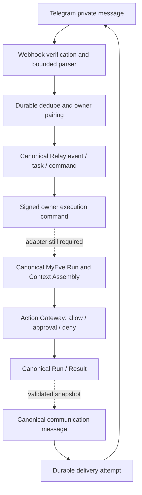
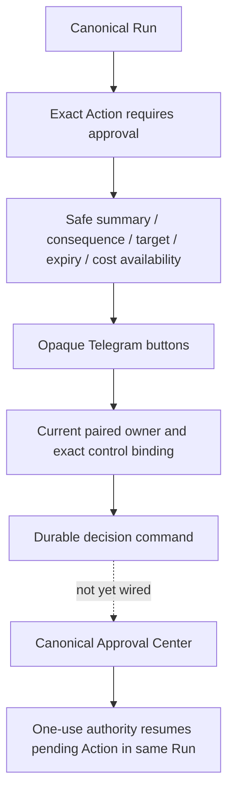
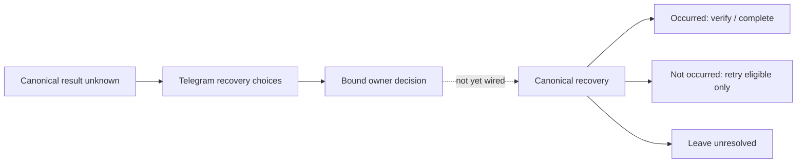
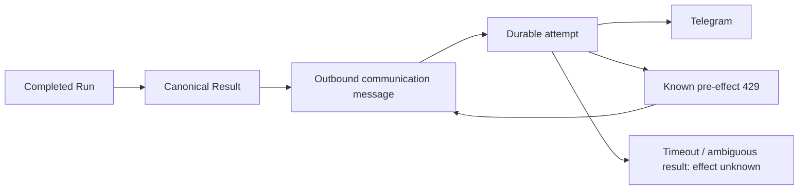

# Telegram private-beta qualification record

## Verdict and scope

**INCOMPLETE — NOT_READY_FOR_HOSTED_GOLDEN_PATH. NOT_READY_FOR_LIMITED_BETA.**

This continuation implements and locally tests the Relay channel pipeline. It does **not** complete the canonical MyEve executor adapter or prove canonical Telegram approval continuation. Missing credentials are not the blocker. The remaining work is code and qualification, listed below. `OWNER_EXECUTOR_QUALIFIED` is deliberately false: configuration cannot enable this unfinished execution path. The existing `private-preview` execution denial is also retained.

- Live Telegram scenarios: **0**.
- Hosted resources created, live webhooks registered, Production execution enabled, merges to main: **0**.
- Production-capable Ed25519 signing implementation: **PRESENT**.
- Production signing credential: **NOT CONFIGURED**; no credential requested in chat.
- Dedicated private-beta bot required: **YES**; not created.
- No local fixture is counted as live evidence or as canonical MyEve execution evidence.

## Source identity

- Relay canonical main inspected: `7ea29b2886d2b8bad7b1a1ca1c3e8df1d39ee9ee`.
- Continuation parent: `89d6b053196566486648c3bbc7ac36d196a0e0c1` on `feat/relay-v2-telegram-private-beta`.
- Earlier foundation: `dc296d5` path-safe Vitest alias; `7097f00` provider error containment; `cd2c298` enrollment/input; `89d6b05` historical evidence.
- MyEve inspected without source changes: `396631a`, branch `codex/openbot`. Its Federation, Action Gateway and routine tests are existing-component regressions, not Telegram integration tests. Concurrent unrelated edits appeared in that checkout during this task and were preserved; these runs are observations of the working tree, not attestations of a clean immutable MyEve commit.
- Relay migration sequence is independent of MyEve. Relay main ends at 0020, enrollment at 0021, this additive migration at **0022_channel_execution**. No prior migration is rewritten. MyEve migration numbers are not used to select Relay numbers.
- Work was performed in an isolated shared clone after reads in the original worktree stalled. The original worktree was preserved. Implementation commit: `842702ab5a9ba683925549cd50f1bda994756ec3`. Security-patch commit: `133e657`. Permanent handoff checkout: `/Users/jaywest/Documents/ChatGPT/New project/relay-telegram-channel-continuation`.

## Implemented architecture



`lib/v2/channels` contains strict transport contracts, signing/configuration, durable admission, control correlation, worker dispatch, outbound delivery and owner management. The Telegram parser and sender remain provider-specific. The WorkRequest and sender interfaces do not accept provider credentials or model-selected destinations.

Relay reuses `v2_events`, `v2_tasks`, `task_commands`, `communication_threads`, `communication_messages` and capability grants. The channel worker owns only `CHANNEL_*` commands; the existing Temporal worker claims/reaps only `START_TASK`. Admission writes the canonical event, task, command, encrypted message and channel link in one transaction. A failed admission does not acknowledge durable work.

Migration 0022 adds projections for channel-to-canonical-Run references, opaque control correlation, delivery attempts, signature nonces and command receipts. It does not add another Run, Action, Approval or Result authority model. The generated full-schema snapshot explains most of the diff size. Changing canonical orchestration is limited to transactional admission and command-kind isolation.

## Trust boundaries

| Boundary | Evidence / enforcement |
|---|---|
| Telegram provider authenticity | Constant-time verification of `X-Telegram-Bot-Api-Secret-Token` before parsing |
| Telegram user identity | Stable numeric private-chat and sender IDs; sender must equal chat; bot updates rejected |
| Relay owner identity | Five-minute, one-use owner-created pairing challenge; active human OWNER membership rechecked |
| Agent identity | Exact assigned account-owned Agent, current status and explicit channel grants; no fallback |
| Relay signing | Pinned Ed25519 key ID, environment, audience and exact command hash |
| MyEve owner / Agent mapping | **Not implemented**; must be explicit, independently authorized and rechecked by the canonical adapter |
| Action authority | **Not granted by pairing or signature**; canonical Action Gateway must decide |
| Channel destination | Stored binding and canonical thread; final send rechecks identity and permission |

Federation authority must not be accepted at the owner-ingress endpoint. The existing MyEve Federation work adapter uses different authority and context rules and was not repurposed. Owner-private Knowledge access through Telegram remains unqualified until the canonical adapter enforces Context Assembly scope.

## Pairing, admission and management

The owner management API is `/api/v2/operator/telegram`; the panel is on `/v2/connections`. Mutations require an authenticated owner session and same-origin request. Pairing explicitly grants receive/reply channel capabilities and creates a deep link; only the challenge hash persists. The link is returned only to the owner, is not logged, and expires after five minutes. Refresh after pairing observes durable state.

The private input boundary accepts at most 32 KiB raw JSON, 4096 text characters and two seconds to read the body. Group/channel/edited/forwarded/reply-context/media updates and bot-generated input are rejected. Attachments are not downloaded. Messages predating pairing are rejected. Duplicate update/message IDs return the original admitted task. User text cannot select another owner or Agent.

One canonical communication thread maps to the paired private chat. Admission allows at most ten messages per minute and four unfinished requests per binding. Work starts in chat order; only one command per binding is dispatched at a time. `/help`, `/start` without a challenge and `/status` produce bounded infrastructure replies without starting an Agent Run. Unknown commands produce a safe response.

The management panel covers not configured, ready to pair, paired, revoked, Agent unavailable, execution disabled, approval/recovery waiting, delivery failure and provider attention. Revocation requires an explicit UI confirmation. Pairing and send/dispatch boundaries share a database lock so a completed revocation prevents new dispatch/send. Re-pairing requires a new connection identity; stale controls remain bound to the revoked identity.

**Limit:** revocation does not yet cancel work already admitted inside MyEve. Executor-side lease/cancellation propagation remains required. This is another reason execution stays release-gated.

## Signing and execution contract

The Relay process owns the private Ed25519 key. The executor owns a pinned map of public keys and never receives the private key. The signed canonical envelope includes:

- Domain `relay.owner-execution.v1`, environment, audience, key ID and scope `owner.run`.
- UUID nonce, issued timestamp and expiry exactly 60 seconds later; at most five seconds future clock skew, at most 60 seconds age, and no expired request.
- SHA-256 canonical command hash covering command ID, operation, account, owner, Agent, thread, task/request, source binding, ingress, message, lifetime, budget and exact decision reference/hash/choice.

The receiver verifies before runtime authorization, consumes a durable nonce, and records a durable command receipt. Reusing the same envelope is rejected. A newly signed identical command can retrieve a completed receipt; changed bindings are denied. A receipt without a confirmed response requires canonical reconciliation, never blind re-execution. Cached responses are encrypted.

HTTP dispatch pins one HTTPS endpoint, refuses redirects and bounds response size. The worker fences its database claim, rechecks channel authority immediately before dispatch and records canonical Run/Result references from the snapshot. Ambiguous transport outcomes become status reconciliation. A crashed start is not resent automatically. Retry exhaustion becomes a visible dead-lettered Relay task. Pending work has a 24-hour channel lifetime and status polling is delayed, not a busy loop.

The request declares bounds of 60 execution seconds, eight model steps, 12,000 tokens, USD 0.10 model spend and twelve actions. **These are contract declarations, not yet proven canonical runtime enforcement.** A concrete adapter must enforce them before the release gate changes.

Rotation seam: install a new pinned public key in the executor, switch Relay's configured key ID/private key, then remove the old public key after the 60-second request window. Separate Preview and Production keys, audiences, environment identifiers and storage. Removing a trusted key denies it immediately.

## Approval and recovery



Callback data contains only a random control ID and a bounded choice. It contains no action parameters, credentials or approval token. Correlation is durable and bound to account, pairing, task, canonical reference, immutable binding hash, kind and expiry. Wrong owner, revoked pairing, wrong choice class, expired control or changed pending snapshot is denied. A database lock allows one decision to win; replay cannot enqueue another decision.

The implemented test proves callback correlation and one durable decision command. It does **not** prove a canonical approval decision or provider effect. Research=1, draft=1, effects before=0, effects after=1 remain **NOT QUALIFIED** for Telegram.



Recovery uses the same opaque-control projection and a distinct command operation. It must delegate to MyEve's existing recovery CAS; no channel-side recovery mutation or automatic resend is implemented. Telegram callback spinner acknowledgement and expired-button presentation still need qualification.

## Work completion and delivery



Delivery never restarts Agent work. At most three attempts are allowed, and only a confirmed Telegram 429 with `ok:false` schedules retry (delay clamped to 1–3600 seconds). Authentication failure marks the connection as needing attention. Invalid/blocked destinations fail permanently. Network errors, malformed responses and 5xx are ambiguous and are not automatically resent. A crashed SENDING attempt becomes EFFECT_UNKNOWN.

The provider receives plain text with previews disabled and no Markdown/HTML parse mode. Replies are bounded to 3800 characters. Longer results are shortened with a notice; a canonical full-result deep link is still missing. Destination identity is taken from stored binding/thread state and rechecked at the final send boundary. Revoked queued replies are suppressed.

Message text, result snapshots, reply bodies and command responses use the existing encrypted secret envelope at rest. Audit events and delivery receipts contain safe IDs, outcomes and attempt counts, not bodies or provider exceptions. Synthetic private-text tests verify absence from stored audit/message JSON outside ciphertext. Automatic content retention/Forget integration and nonce/receipt pruning remain unimplemented; no new retention promise is made.

## Configuration contract

All values belong in the isolated deployment's approved secret/configuration store, never a Codex message or committed `.env`.

| Variable | Secret? | Consumer / purpose |
|---|---|---|
| `RELAY_TELEGRAM_ENABLED` | No | HTTP ingress and channel worker, default false |
| `RELAY_TELEGRAM_EXECUTION_ENABLED` | No | Requested execution flag; release gate and private-preview denial still override |
| `RELAY_DEPLOYMENT_MODE` | No | Existing deployment isolation; `private-preview` always denies execution |
| `RELAY_CHANNEL_ENVIRONMENT` | No | Signing domain: development / preview / production |
| `RELAY_TELEGRAM_CONNECTION_ID` | No | Exact canonical bot connection |
| `RELAY_TELEGRAM_ACCOUNT_ID` | No | Exact Relay account |
| `RELAY_TELEGRAM_OWNER_PRINCIPAL_ID` | No | Explicit human owner, never first sender |
| `RELAY_TELEGRAM_AGENT_ID` | No | Explicit assigned Agent, never primary fallback |
| `RELAY_TELEGRAM_BOT_USERNAME` | No | Bot identity and pairing deep link |
| `RELAY_TELEGRAM_BOT_TOKEN` | **Yes** | Outbound Telegram sender only |
| `RELAY_TELEGRAM_WEBHOOK_SECRET` | **Yes** | Ingress authentication; 32–256 base64url characters |
| `RELAY_OWNER_EXECUTOR_URL` | No | Pinned HTTPS execution endpoint; **concrete MyEve route not implemented** |
| `RELAY_OWNER_EXECUTOR_AUDIENCE` | No | Exact expected executor audience |
| `RELAY_CHANNEL_SIGNING_KEY_ID` | No | Public key lookup identifier |
| `RELAY_CHANNEL_SIGNING_PRIVATE_KEY` | **Yes** | PKCS8 Ed25519 PEM; Relay signing only |
| `RELAY_DATABASE_URL` (or `DATABASE_URL`) | **Yes** | Canonical isolated PostgreSQL: pairing, dedupe, work, delivery, controls |
| `RELAY_ENCRYPTION_KEY` | **Yes** | Existing at-rest encryption boundary |
| Public worker origin | No | Host-level HTTPS origin for registration; no hard-coded deployment URL |

Executor configuration additionally needs explicit Relay-account/owner/Agent to MyEve-owner/Agent mapping, public-key pins, isolated replay storage and canonical runtime readiness. This is a missing implementation contract, not a request for credentials.

Webhook route: `https://<isolated-worker>/api/channels/telegram/webhook`. Readiness route: `/api/channels/telegram/ready`; ordinary health remains `/api/health`. Health means process serviceability. Channel readiness checks configuration and storage. Execution readiness additionally checks active pairing, owner/Agent/grants and the qualification gate; it is currently false. Neither liveness nor populated environment variables establishes canonical execution readiness.

Webhook secret setup, for the future authorized live phase: generate a high-entropy base64url secret in the approved secret-management environment; inject it in Relay; supply the same value as Telegram's `secret_token` at `setWebhook`; Relay verifies the header. Rotation requires updating registration and Relay together. Revocation requires disabling ingress/execution and removing the webhook. No production secret was generated here.

## Host requirements and unexecuted live plan

A compatible host must run a persistent HTTPS Node service (`pnpm start`) plus a supervised background process (`pnpm worker:channels`), connect to isolated PostgreSQL, inject secrets, permit outbound HTTPS to the pinned executor and Telegram, and provide restart/shutdown controls and logs without sensitive bodies. A conventional VM/container service or container PaaS satisfies these runtime requirements. A request-only serverless deployment needs a separate durable worker and does not by itself satisfy them. Compare costs only after sizing; no pricing or provider selection is claimed here. No proprietary queue is required.

After the missing code/qualification is complete:

1. Deploy an isolated worker and database; apply Relay migrations; configure a synthetic owner and test Agent. Keep execution disabled. Install public-key pins and explicit cross-runtime mappings. Verify health separately from readiness.
2. Owner creates a dedicated bot using BotFather `/newbot`, chooses a name/unique username, and stores its token in the approved secret store. Do not paste it into chat. Register only the isolated webhook with the secret header. The owner creates and consumes the one-use pairing link.
3. Use an explicitly qualified execution profile that preserves existing private-preview denial. Enable only the isolated test path after readiness is true. Ask “What are my active goals?” and correlate exactly one ingress, WorkRequest, canonical Run, Result and Telegram reply.
4. Request a harmless reversible artifact write in an isolated workspace through the canonical Action Gateway. Verify zero effects before approval and exactly one afterward, same Run, research/draft once, callback replay denied. Do not substitute real email, calls or publishing.
5. Exercise recovery without resend, duplicates, restart at admission/approval/delivery, disablement and revocation. Record IDs and sanitized evidence only.
6. Disable execution, revoke pairing, remove the webhook, remove disposable fixtures/resources and their secrets. Preserve the bot only if the owner elects to keep it for beta.

No step above was executed live.

## Qualification evidence and remaining gates

The PostgreSQL fixtures use disposable local PostgreSQL 17 at loopback port 55439. Migrations are exercised from a fresh database and from both prior Relay schemas 0020 and 0021; repeated migration preserves sentinel data.

The 18 new channel tests qualify durable ingress/dedupe, worker status reconciliation, callback correlation, permission/revocation checks, encryption containment, bounded queue, signature replay/mutation/environment rejection, provider classification and delivery-only retry. The executor in these tests is a deterministic **transport fixture**, not a canonical Agent runtime. Existing enrollment/parser tests continue to cover expiry, replay, malformed/private-only input and bot/attachment rejection.

Current local checks and final source identity are recorded in the verification update below. Do not add focused reruns to distinct-test totals.

Remaining implementation requirements before `READY_FOR_HOSTED_GOLDEN_PATH`:

- Concrete authenticated MyEve owner-ingress endpoint and governed canonical Run/Context Assembly adapter with explicit cross-runtime identity mapping.
- Generic canonical immutable pending-action checkpoint and continuation, independent of routine occurrences; true research/draft/effect counter proof through Action Gateway.
- Canonical recovery decision integration, owner/channel revocation propagation to already-admitted work, cancellation, and budget enforcement at each execution/effect boundary.
- Durable reconciliation for a crash after Relay dispatch claim but before canonical Run admission. Current behavior is safe refusal/reconciliation, not a proven liveness recovery.
- Full requested security matrix, private Knowledge/Federation separation for the new ingress, recovery and approval expiry/replay/restart effects, retention/Forget handling, callback acknowledgement and full-result navigation.
- Hosted golden path remains deliberately unrun. Human approval comprehension/accessibility review, independent security review and cohort authorization are separate later gates.


## Final verification update — 2026-09-20

| Check | Observed result |
|---|---|
| Relay serial regression suite, patched dependencies | 47 files passed, 3 opt-in files skipped; **231 passed / 5 skipped** |
| Final focused run after timeout/scoped-worker fixes, including opt-in providers | 5 files / **40 passed**; overlaps the serial suite, not additive |
| Distinct Relay non-performance tests across these runs | **237 passed**, including the new timeout test and all five opt-in tests |
| Existing performance tests | **2 passed**; dashboard p95 1.238458 ms; concurrency p95 37.347500 ms, 64 operations, zero error rate |
| Production-build mobile/keyboard test | **1 passed** at 390 × 844; management states, overflow and keyboard revocation; API state fixtures |
| MyEve existing regression subset | 10 files / **124 passed** (Federation, Action authority/recovery, routine admission/resume/release) |
| Existing MyEve executor inventory | 513 classified sources; **UNKNOWN=0**; routine activation remains disabled |
| Typecheck / lint / final production build | **PASS** |
| Fresh schema and upgrades from Relay 0020 and 0021 | **PASS**, including repeat migration and sentinel preservation |
| Drizzle consistency / frontier check / diff whitespace | **PASS** |
| Production dependency audit | **No known vulnerabilities found** after scoped patches |
| Patched sharp image processing | **PASS**, local synthetic PNG resize |
| Canonical Telegram Run / approval / recovery golden paths | **NOT QUALIFIED**; deterministic transport fixtures do not substitute |
| Live Telegram / hosted qualification | **NOT RUN**, explicitly zero scenarios |

Dependency qualification initially found nine advisories (two critical, five high, two moderate). The isolated fix updates Next and its ESLint package to 15.5.24, Playwright/test to 1.55.1, and pins Next's PostCSS to 8.5.23 and sharp to 0.35.4. These changes address observed blockers; unrelated dependencies were not broadly upgraded. The patched browser runner required installing its matching Chromium revision before the successful rerun. See the [Next.js advisory](https://github.com/advisories/GHSA-p293-qw3h-jr36) and [PostCSS advisory](https://github.com/advisories/GHSA-fxqj-rqcc-2cmp).

Other reproduced corrections: the nonce table originally lacked the required account column; the release-gate test caught it and passed after regeneration. Generic Temporal claims originally lacked a command-kind filter; a regression now proves channel commands remain unclaimed by that worker. The body timeout now rejects before cancelling the stream, preventing cancellation from appearing as successful empty input. The first browser run lacked a V2 owner membership in the disposable fixture; the test now provisions that membership only in a guarded loopback `relay_e2e_*` database.

Parallel migration audit: the separate local `codex/relay-federation` branch has `0021_violet_captain_stacy`, while this branch already has `0021_telegram_pairing`. No inspected branch used 0022. **The existing 0021 collision must be reconciled before combining those branches.** No branch was merged or renumbered here.

Reproduction commands (use an isolated local PostgreSQL server):

```sh
RELAY_TEST_DATABASE_URL=postgresql://127.0.0.1:55439/postgres pnpm test:ci
RELAY_TEST_DATABASE_URL=postgresql://127.0.0.1:55439/postgres RELAY_LIVE_PLAYWRIGHT=1 RELAY_LIVE_DOCKER=1 pnpm exec vitest run tests/browser/playwright-live.test.ts tests/sandbox/docker-live.test.ts tests/v2/relay-managed-provider-live.test.ts tests/v2/channel-pipeline.test.ts tests/v2/telegram-input.test.ts --fileParallelism=false
RELAY_TEST_DATABASE_URL=postgresql://127.0.0.1:55439/postgres pnpm test:performance
pnpm typecheck
pnpm lint
pnpm build
RELAY_DATABASE_URL=postgresql://127.0.0.1:55439/postgres pnpm db:check
pnpm v2:frontier:check
pnpm audit --prod --audit-level=moderate
git diff --check
```

The committed browser test also runs under the standard Playwright configuration after its disposable seed. For the recorded production-build run, a temporary config selected only `telegram-connection.spec.ts` at loopback port 3219, with `RELAY_UI_TEST_DATABASE_URL` pointing to the disposable UI database. No screenshot contained a pairing secret. Temporary browser configuration and test output are not committed.

Cleanup and handoff: local app server stopped; disposable PostgreSQL stopped and its cluster removed; test provider containers checked; no hosted resources or live credentials existed to revoke. No `.env`, database, browser profile, test output or machine dependency tree is committed. The feature branch is preserved for review, with execution gated. No PR claiming golden-path completion and no main merge are authorized by this evidence.
