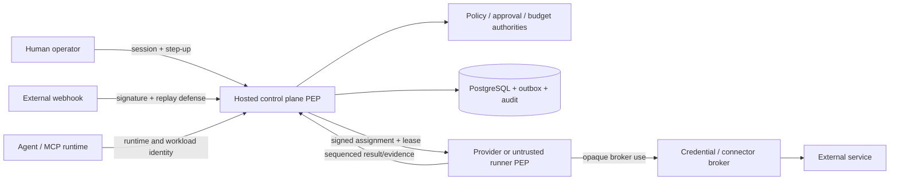

# WO-02 independent security review package

Status: `REQUIRES_HUMAN_REVIEW`  
Prepared: 2026-09-13  
Review target: Relay V2 on `feat/relay-v2` at or after `e6c64169f67cf3e703fadc9e4b508b5b4a1b7a13`

This package prepares, but does not perform or self-certify, the independent security-owner review. The reviewer must inspect source and executable evidence, record findings, and sign a dated disposition.

## 1. Scope and validated assumptions

In scope: the hosted authoritative multi-tenant control plane; internet-facing REST/MCP/webhook boundaries; untrusted Agent runtimes, execution providers, customer runners and private gateways; identity, Passports, policy, approvals, budgets, capability leases, event orchestration, connectors, communications, computer control, money, evidence and audit.

Assumptions already fixed by the approved V2 architecture:

- Relay's hosted control plane is authoritative for durable identity, tenancy, policy, approval, budget, routing, authorization and audit facts.
- Runtimes, models, provider metadata, webhook content and customer runners are untrusted inputs.
- A self-hosted runner is not an independent control plane and receives only bounded, short-lived Relay authority.
- V1 is frozen and out of scope. Fully self-hosted control plane, V2.1 and V3 are out of scope.
- Data may include confidential communications, restricted connector content, credential references and financial intent/receipt records.

## 2. System and trust-boundary model

Primary boundaries and source anchors:

| Boundary | Security property | Primary anchors |
|---|---|---|
| Human browser → control plane | Session-derived tenant, same-origin mutation, once-only bound step-up | `lib/auth.ts`, `lib/v2/identity.ts`, `app/api/v2/operator/` |
| Runtime/MCP → control plane | Runtime identity is separate from Agent identity; audience and account binding | `lib/v2/runtime-clients.ts`, `lib/v2/developer-platform.ts` |
| Webhook/provider → ingress | Signature before persistence, endpoint/tenant binding, replay/dedupe | `lib/v2/orchestration.ts`, `lib/v2/communications.ts` |
| Control plane → provider/runner | Signed task/workload/lease, TTL, call/resource/audience bounds, online checks for high risk | `lib/v2/leases.ts`, `lib/v2/execution-providers.ts`, `lib/v2/runners.ts`, `lib/v2/providers/` |
| Workload → connector/external resource | Brokered opaque credentials, projected capability, exact destination/action | `lib/v2/connectors.ts`, `lib/v2/money.ts` |
| Workload/provider → evidence | Tenant/task/action/lease binding, redaction, signed hash chain | `lib/v2/evidence/` |
| Human ↔ live computer | Exclusive controller and monotonically fenced input | `lib/v2/computer-control.ts`, `lib/v2/money.ts` |

## 3. Assets and security objectives

| Asset | Objective |
|---|---|
| Tenant identity/membership | No cross-account read, mutation, routing or confused-deputy use |
| Agent Passport and grants | Signed, monotonic, revocable eligibility; Passport is not bearer authority |
| Policy/approval/budget state | Exact action binding, atomic consumption/reservation, fail closed on uncertainty |
| Capability lease/workload identity | Short-lived, task/resource/audience/call bounded, proof-of-possession and revocable |
| Connector/payment credentials | Non-exportable broker references; no model/log/evidence/screenshot leakage |
| External effects and receipts | Stable idempotency/fencing; unknown effects are not automatically retried |
| Audit/evidence | Redacted, tenant scoped, signed, ordered and independently verifiable |
| Runner/private network | Outbound-only, named-resource constrained, no durable secret or authority |

## 4. Attacker capabilities

- Malicious or prompt-injected Agent controlling tool inputs and trying to widen authority.
- Tenant user/runtime possessing valid credentials for its own account and probing identifiers from another.
- Compromised provider/runner fabricating evidence, replaying assignments or retaining secrets.
- External sender replaying or forging webhook traffic and provoking communication loops.
- Network attacker targeting OAuth callbacks, redirects, metadata services or private endpoints.
- Concurrent caller racing approval consumption, budget reservations, lease counters or controller takeover.
- Supply-chain attacker replacing provider packages/images or exploiting unsigned release paths.
- Privileged insider attempting to alter policy, evidence, release configuration or retention outside governance.

## 5. Tenant and authority model

Every tenant-owned persistence, API, queue/workflow, runner, object/evidence, computer, communication, connector, approval and budget boundary must derive `account_id` from authenticated context and retain it in reads, writes, object keys and causal envelopes. Cross-account sharing is absent in V2.

Authority is an intersection, never a union:

`active identity ∩ membership ∩ Passport eligibility ∩ capability/grant ∩ current policy ∩ exact approval ∩ available budget ∩ bounded lease ∩ provider/environment constraints`.

The runner may verify local cryptographic claims and enforce a stricter local policy, but may not create identity, approval, budget, grant, lease or revocation truth.

## 6. Approval, budget and concurrency model

- Canonical action material binds capability/version, resource, parameters, destinations/recipients, classifications, and financial merchant/amount/currency where applicable.
- Policy records the evaluated action, material facts, capability hash, policy bundle hashes, outcome and obligations.
- Approval binds the exact canonical action hash, approver, class, permitted scope and authentication evidence.
- Consequential lease issuance atomically consumes an approval against an unchanged action.
- Budget reservation is transactional and hierarchical; contention serializes against the hard limit.
- Human checkout fences Agent input, reveals only the credential display reference, validates final material fields, records a redacted receipt and commits or marks the budget outcome unknown.
- Any changed material argument, expired/stale approval, exhausted budget, revoked/expired lease or unknown authoritative dependency fails closed.

## 7. Secret-handling model

- Durable credentials are stored as opaque broker/vault references; raw provider/payment credentials are not an Agent capability.
- Workload secret materialization is assignment scoped, memory/tmpfs only, non-renewable by the workload and revoked with assignment/runner/lease authority.
- Protected human entry disables Agent input and should suppress screenshots/video/clipboard telemetry in the production-qualified provider.
- Evidence redaction removes configured secrets, payment numbers and restricted fields before persistence.
- Production KMS/HSM, vault, object encryption context, rotation, canary and cryptographic-erasure behavior remain external qualification.

## 8. Priority abuse paths

| ID | Abuse path | Impact | Existing control | Residual risk / required review |
|---|---|---|---|---|
| AP-01 | Agent mutates recipient/merchant/amount after approval | Unauthorized communication/payment | Canonical hash, once approval, exact final review, new intent required | Verify every adapter maps all material fields into canonical form |
| AP-02 | Tenant substitutes another account's object ID | Cross-tenant disclosure/effect | Session-derived account plus account predicate and isolation suite | Independent API and direct-ID pentest |
| AP-03 | Stolen lease replayed on another workload/provider | Unauthorized effect | PoP workload binding, audience/resource/call/TTL bounds, atomic receipts | Review token signing/key rotation and clock-skew assumptions |
| AP-04 | Revoked runner continues offline | Stale authority | Short offline allowance only for low-risk reads; high-risk online check; epoch cascade | Live revoke-latency and network-partition qualification absent |
| AP-05 | Malicious runner fabricates success/evidence | False audit/provenance | Assurance labels, Relay-observed/provider-signed preference, signed chain | Customer-host honesty cannot be proven; reviewer sets accepted tier |
| AP-06 | Provider timeout causes duplicate external effect | Duplicate message/purchase/change | Stable idempotency, effect-state fencing, unknown-effect terminal state | Live provider idempotency/reconciliation evidence absent |
| AP-07 | OAuth/redirect/connector confused deputy | Cross-account provider access | State/account binding, opaque credential handle, capability projection | Live OAuth scope/refresh/revoke packs absent |
| AP-08 | Browser/private gateway pivots to metadata/private network | Credential theft/lateral movement | Named resources, IP/DNS/redirect validation contract, separate egress authority | Live network capture and SSRF pentest absent |
| AP-09 | Approval link or UI misleads approver | Wrong human decision | Authenticated non-bearer locator, step-up, visible summary/consequence/evidence | Human comprehension and screen-reader studies pending |
| AP-10 | Budget race oversubscribes shared limit | Financial loss | Transactional reservation and contention tests | Review database isolation and production retry behavior |
| AP-11 | Secret appears in artifact/log/model context | Credential compromise | Broker-only access, protected entry, redaction/canary tests | Production logs/traces/screenshots/provider payload canary pending |
| AP-12 | Unsigned/malicious adapter or release deployed | Broad compromise | Versioned registries, immutable digest contract, kill switch | GitHub protections currently failed; signed CI provenance absent |

## 9. Failure modes that must remain fail closed

- Identity, membership, policy facts, approval, budget, lease, authoritative database or online authorization unavailable during a consequential action.
- Provider response ambiguous after possible effect: mark `EFFECT_UNKNOWN`; never blind retry.
- Evidence finalization unavailable after a consequential effect: hold success acknowledgment and reconcile.
- Connector/channel revoked, disabled, expired or permission-drifted: deny; never use stale durable material.
- Runner disconnect: do not extend authority; only declared low-risk offline work may complete before cryptographic expiry.
- Concurrent human/Agent input: monotonically fenced exclusive controller wins; stale input is rejected.

## 10. Executable evidence index

| Property | Evidence |
|---|---|
| Identity/membership/step-up | `tests/v2/identity.test.ts`, WO-03 ledger entry |
| Passport and rollback/revocation | `tests/v2/passports.test.ts` |
| Policy facts/decision behavior | `tests/v2/policy.test.ts` |
| Approval binding and replay | `tests/v2/approvals.test.ts` |
| Budget atomicity/concurrency | `tests/v2/budgets.test.ts`, `tests/v2/money.test.ts` |
| Workload identity/lease/epoch | `tests/v2/leases.test.ts` |
| Event/outbox/fencing/DLQ | `tests/v2/orchestration.test.ts` |
| Provider isolation/failure | `tests/v2/execution-providers.test.ts`, `tests/v2/third-party-providers.test.ts`, provider qualification suites |
| Runner authority/revocation | `tests/v2/runners.test.ts` |
| Communication and connector isolation | `tests/v2/communication-providers.test.ts`, `tests/v2/connector-providers.test.ts` |
| Computer control fencing | `tests/v2/money.test.ts`, `tests/v2/dashboard.test.ts` |
| Evidence redaction/integrity | `tests/v2/evidence.test.ts` |
| Financial exactness/unknown effect | `tests/v2/money.test.ts` |
| Aggregate isolation registry | `tests/v2/release-qualification.test.ts`, `docs/v2/qualification/wo22-gate-matrix.md` |

The 2026-09-13 focused trusted-action run passed 33/33 assertions across leases, orchestration, approvals, money and evidence. The complete earlier WO-22 local aggregate was 170/170 runnable tests with 4 opt-in provider tests skipped. Live provider and production topology results must be reviewed separately; mocks do not close those gates.

## 11. Known limitations and non-claims

- Browserbase, E2B, Slack, Telegram, Google Drive, Linear and customer-runner contracts are not live-qualified.
- There is no production-like Temporal, distributed worker, object-store, KMS/vault, telemetry or regional failover evidence in the current environment.
- The only live execution evidence is the conservative ephemeral Relay-managed profile; persistent profiles and permanent desktop fleets are not qualified.
- Actual unattended payment is disabled. The implemented path is a protected human checkout with approval and budget control.
- Customer-runner attestation does not establish host honesty.
- Automated accessibility does not establish assistive-technology usability or approval comprehension.
- GitHub `main`, tag/release and deployment-environment protections were absent when inspected.
- No statement in this package constitutes GA readiness.

## 12. Reviewer procedure and sign-off record

The independent reviewer must:

1. Confirm scope and assumptions or record corrections.
2. Trace AP-01 through AP-12 to source and tests.
3. Run the tenant-isolation and trusted-action suites in a clean disposable environment.
4. Sample audit-chain verification and redaction/canary behavior.
5. Review cryptographic formats, key IDs, TTL/clock behavior and revocation epochs.
6. Review every external blocker and decide which must close before a limited beta.
7. Classify each finding, assign owner and due date, and require a retest for critical/high issues.
8. Record one decision: accept, accept with time-bounded exceptions, or reject.

| Reviewer | Organization/role | Review date | Commit reviewed | Decision | Findings/report | Exception owner/expiry | Signature |
|---|---|---|---|---|---|---|---|
| _required_ | _required_ | _required_ | _required_ | _required_ | _required_ | _if applicable_ | _required_ |

Until this record is completed by an independent security owner, WO-02 remains `REQUIRES_HUMAN_REVIEW`.
