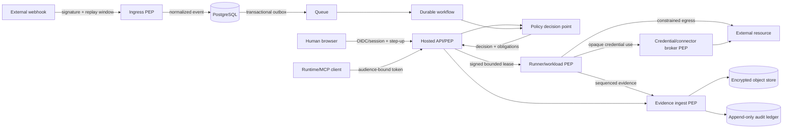

# Relay V2 security architecture

WorkOrder: WO-02  
Status: Implemented; independent security-owner review pending

## Security objective

Relay must let an untrusted or compromised Agent perform only the exact action that the authoritative control plane allowed, on the declared resource, within time/call/budget/environment limits, while preserving tenant isolation, human control, credential secrecy, and reconstructable evidence.

The Agent plan, model text, runtime label, runner report, provider metadata, network location, and prior approval are not independently sufficient authority.

## Data flow and enforcement boundaries

### Boundary B1 — Human browser to control plane

- Server-verified session identity; account derived from session.
- Same-origin mutation protection, CSRF defenses, session rotation, secure cookies.
- Step-up authentication binds user, account, action class, nonce, and short expiry.
- Approval deep links are locators, never bearer authorization.

### Boundary B2 — Runtime client to control plane

- OAuth/resource audience or service-client identity; no downstream token accepted.
- Agent and runtime identities are separate. Product name/version claims are untrusted metadata unless registered.
- Every request is account scoped, rate limited, schema validated, and correlated.

### Boundary B3 — External provider to event ingress

- Provider-specific signature, timestamp, endpoint/tenant binding, body-size limit, and replay window.
- Raw body is preserved only when policy permits; normalized data is classified before routing.
- Event content never supplies authoritative account, Agent, capability, policy, or recipient-ownership facts.

### Boundary B4 — Control plane to execution provider/runner

- mTLS runner identity plus per-assignment workload identity.
- Assignment and lease are separately signed, tenant bound, audience bound, expiring, and replay protected.
- Runner is not a policy, approval, grant, budget, or revocation authority.
- High-risk actions require online permit/introspection immediately before effect.

### Boundary B5 — Workload to external resource

- Relay broker is preferred for connector calls and credentials.
- Generic browser/computer egress is policy constrained; private/link-local/metadata ranges are blocked unless a named private resource is leased.
- Provider idempotency key or Relay reconciliation controls repeated effects.

### Boundary B6 — Evidence ingest and storage

- Evidence sequence, assignment, account, workload, action, and lease are verified before append.
- Manifests are canonicalized, hashed, signed, and linked. Artifacts are encrypted and content classified.
- Evidence source is labeled `relay_observed`, `provider_signed`, or `runner_reported`; lower assurance is never upgraded by presentation.

## Authoritative fact ownership

| Fact | Authority | Rejected substitutes |
|---|---|---|
| Account and membership | Relay identity service | Request body, webhook payload, runtime claim |
| Agent identity/status | Relay Agent registry | Runtime name, Passport bearer |
| Capability eligibility | Relay grants/registry | MCP tool annotation, provider manifest alone |
| Policy version/decision | Relay policy service | Runner/Agent evaluation |
| Approval | Relay approval service | Chat text, URL token, screenshot |
| Budget availability | Relay budget transaction | Agent counter, provider estimate |
| Lease status/calls | Relay lease service and PEP | Cached token beyond offline allowance |
| Provider/runner assurance | Relay provider registry | Self-declared runner label |
| External outcome | Provider receipt plus reconciliation | Model statement alone |

## Tenant isolation design

- `account_id` is required on every tenant-owned aggregate, outbox record, queue envelope, cache key, object key, trace attribute, and search document.
- API account context is derived from authenticated identity and cannot be selected by request payload.
- Repository methods accept an account context and include it in every lookup, update, and delete predicate, including lookups by globally unique ID.
- Foreign keys and composite unique indexes retain account context where cross-table substitution is possible.
- Workers validate queue tenant against loaded aggregate tenant before processing.
- Signed object URLs are short-lived, single-account, artifact-specific, and content-disposition constrained.
- Cross-account sharing and delegation are absent in V2; no generic bypass flag exists.

## Data classification and handling

| Class | Model context | Evidence | Logs/traces | Execution floor |
|---|---|---|---|---|
| Public | Allowed by task | Normal retention | Metadata and allowed content | Registered runner permitted |
| Internal | Purpose scoped | Encrypted; tenant access | Metadata; content omitted by default | Registered/managed per policy |
| Confidential | Explicit manifest only | Encrypted; short retention | Identifiers and hashes only | Attested or managed-equivalent |
| Restricted | Default deny; narrow extraction | Capture off or field-redacted unless mandated | No content | Managed-equivalent; online authorization |

Secrets and raw payment credentials are never a classification tier available to the model. They are non-exportable broker material.

## Key and credential lifecycle

### Root and service keys

1. Cloud KMS/HSM protects environment root keys; no root key is stored in application configuration.
2. Separate keys exist for lease signing, Passport signing, evidence signing, session signing, and envelope encryption.
3. Public verification keys carry key IDs, activation, retirement, and revocation time.
4. Rotation supports overlap for verification but only one active signer. Compromise rotates immediately and increments the relevant revocation epoch.
5. Key use is audited without recording plaintext or private key material.

### Tenant data encryption

- Tenant data keys are envelope-encrypted by the environment root and versioned.
- Object artifacts use unique data keys or storage-provider envelope encryption with tenant-bound encryption context.
- Cryptographic erasure deletes tenant data-key material only through the governed deletion workflow.

### Connector credentials

- OAuth refresh tokens and durable provider credentials remain in the credential broker.
- Workloads request `credential.use` with action/resource context; there is no plaintext read contract.
- Prefer provider token exchange or short-lived scoped access. Otherwise the broker performs the provider call.
- Browser credentials are entered by the human in protected takeover or held in a provider profile that never enters Agent context.
- Credential refresh failure closes access and emits a connection-health event; it never falls back to stale durable material.

### Runner and workload identity

- Runner enrollment token is one-time, account-bound, short-lived, and exchanged for a registered public key/certificate.
- Runner certificate renewal requires current registration, version, posture, and non-revoked trust epoch.
- Each assignment creates a fresh workload key. Workload certificates/tokens bind runner, task, account, image/config digest, and audience.
- Workload authority cannot outlive assignment, lease, runner registration, or parent task.

## Runner assurance and attestation

| Tier | Evidence | Permitted default scope |
|---|---|---|
| `registered` | Possession of enrolled runner key; self-reported software/config | Public/internal low-risk work only |
| `attested` | Registered key plus verified platform/workload attestation and signed digest | Confidential work where account policy permits |
| `managed-equivalent` | Relay-controlled or independently qualified isolation, patching, telemetry, and evidence | Restricted/high-risk subject to capability policy |

Customer control of a host means Relay cannot independently prove host honesty. Attestation raises confidence in measured configuration; it does not prove application behavior or operator intent.

## Egress and private gateway controls

- Default-deny network policy for confidential/restricted work.
- Resolve and validate every destination before connect and after redirect; reject loopback, link-local, metadata, multicast, and private ranges unless explicitly named.
- Private gateway resources specify protocol, host/service identity, port, method/action, and optional path/resource patterns. No default CIDR-wide tunnel.
- DNS answers are pinned for the connection window and revalidated to prevent rebinding.
- HTTP proxy removes hop-by-hop and unapproved identity headers, applies body limits, and records destination/effect metadata.
- Raw TCP/UDP and arbitrary shell network egress require separate high-risk capabilities and are not V2 defaults.

## Approval and action integrity

- Canonical action material includes capability version, resource, effect parameters, recipients/destination, attachments, financial amount/currency/merchant, and data classification as applicable.
- Approval records the exact action hash and evidence presentation version.
- Permit issuance atomically consumes approval and budget reservation against the unchanged action version.
- Provider adapter receives a permit-bound action; changes require reauthorization.
- Human and Agent computer input use fencing tokens so only one controller can act.

## Failure behavior

- Policy, lease, approval, budget, identity, or authoritative-store unavailability blocks consequential actions.
- Offline completion is opt-in, low risk, and constrained by unexpired locally verifiable lease. Financial, destructive, new-recipient communication, and restricted-data egress always require online authorization.
- Unknown provider effect is terminal for automatic retries until reconciliation.
- Evidence-store failure prevents final success acknowledgment for consequential actions but does not blindly replay the external effect.

## Threat-control-test traceability

| Threat | Severity | Preventative control | Detective/recovery control | Required test IDs |
|---|---|---|---|---|
| T01 Prompt/tool injection | Critical | Central PEP; destination/data policy; no model authority | Denial/evidence alerts | SEC-INJECT-001..006 |
| T02 Confused deputy/token passthrough | Critical | Audience binding; separate downstream token | Token-use audit | SEC-AUDIENCE-001..005 |
| T03 Lease theft/replay | Critical | Workload binding; short TTL; JTI/counters | Revocation and replay telemetry | SEC-LEASE-001..010 |
| T04 Approval TOCTOU | Critical | Canonical hash; atomic consumption | Supersession evidence | SEC-APPROVAL-001..008 |
| T05 Duplicate external effect | Critical | Stable idempotency/fencing | Reconciliation and unknown state | EVT-IDEMP-001..010 |
| T06 Fabricated runner evidence | High | Assurance labels; provider receipts | Evidence-source display/export | RUN-ASSURANCE-001..005 |
| T07 Cross-workload secret theft | Critical | Per-task isolation; local broker; no env secret | Canary and artifact scan | RUN-ISOLATION-001..010 |
| T08 SSRF/private pivot | Critical | Named resources; DNS/IP/redirect enforcement | Egress audit and kill switch | SEC-EGRESS-001..012 |
| T09 Live-view hijack | High | Viewer-bound short TTL; controller lock | Session revoke/trace | CMP-LIVE-001..008 |
| T10 Approval phishing | Critical | Authenticated page; step-up; non-bearer link | Decision and session audit | SEC-APPROVAL-009..014 |
| T11 Budget race | Critical | Atomic hierarchical reservation | Drift/reconciliation alert | BUD-CONCURRENCY-001..008 |
| T12 Secret in model/log/capture | Critical | Broker/OOB entry/redaction/capture suppression | Canary scans | SEC-SECRET-001..012 |
| T13 Cross-tenant access | Critical | Tenant-derived context everywhere | Isolation telemetry/pentest | SEC-TENANT-001..020 |
| T14 Policy/Passport rollback | High | Signed monotonic revisions/epoch | Activation and stale-revision audit | SEC-ROLLBACK-001..006 |
| T15 Delegation amplification/cycle | Critical | Subset intersection; DAG/depth/fanout | Cascade revoke/provenance | DEL-INVARIANT-001..010 |
| T16 Malicious adapter/supply chain | Critical | Signed package, SBOM, sandbox, permissions | Kill switch/version quarantine | SEC-SUPPLY-001..008 |
| T17 Audit/evidence tampering | High | Hash chain, signatures, object retention | Offline verification | AUD-INTEGRITY-001..010 |
| T18 Event/cost denial of service | High | Distributed quotas/fairness/circuit breakers | Spend/lag alert and DLQ | PERF-ABUSE-001..008 |
| T19 Offline work after revoke | Critical | Short lease; high-risk online check; epoch | Disconnect/revoke alarm | RUN-REVOKE-001..008 |
| T20 Concurrent human/Agent input | High | Exclusive fencing token | Control-boundary evidence | CMP-CONTROL-001..006 |

## Review gate

WO-02 is locally complete when every critical/high threat has an owner category, preventative control, detective/recovery control, test IDs, and explicit residual risk. It is `QUALIFIED` only after an independent security owner reviews this document and the source specification. Until that occurs, the implementation ledger must show `BLOCKED_EXTERNAL_CONFIGURATION` for the independent sign-off rather than a fabricated approval.

